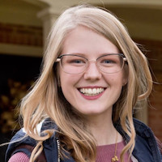
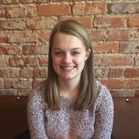
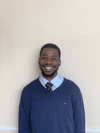
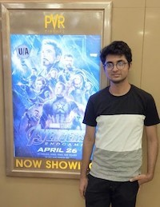
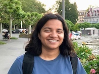
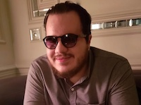
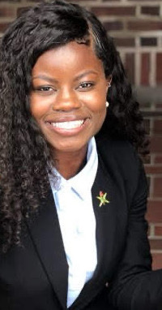
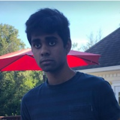
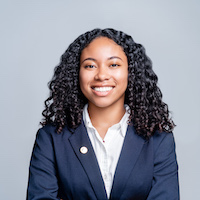

[AAAI-21 UC @ the AAAI site ](https://aaai.org/Conferences/AAAI-21/undergraduate-consortium/)  
Return to [the UC main page](https://aaai-uc.github.io/)

[AAAI 2021 main site](http://aaai.org/Conferences/AAAI-21/)  
Thirty-Fifth AAAI Conference on Artificial Intelligence  
Virtual  
February 2-9, 2021

# AAAI-21 Undergraduate Consortium 

The playlist of AAAI-21 UC pitch videos are [available here](https://www.youtube.com/watch?v=dXsupAQAKgs&list=PLIsth1r16Z2MHJ9jItF2MLGzQgAjH8QN8). 

# Meet our scholars

## Abrar Anwar
  
Sandia National Laboratories   
The University of Texas at Austin   
[https://abraranwar.github.io/](https://abraranwar.github.io/)   
[3-min pitch video](https://www.youtube.com/watch?v=2UVLACiXnM0&list=PLIsth1r16Z2MHJ9jItF2MLGzQgAjH8QN8&index=14)   

Abrar Anwar is a senior studying computer science at the University of Texas at Austin. As an intern at Sandia National Labs, he is currently exploring the evolution of sparse, spiking neural networks topologies for efficient hardware-algorithm codesign. Previously at Sandia, he worked on brain-inspired localization and navigation algorithms. In addition to his research at Sandia, Abrar works on robotics, human-robot interaction, and graphics at UT Austin.

### Abstract 
Neural architecture search (NAS) has emerged as an algorithmic method of developing neural network architectures. Weight Agnostic Neural Networks (WANNs) are an evolutionary-based NAS approach. Fundamentally, WANNs find network structures that are relatively insensitive to shifts in weight values and are typically much smaller than an equivalent performance dense network. Here, we extend the WANN framework to search for spiking circuits and in doing so investigate whether these circuit motifs can also yield task performance that is weight agnostic. We analyze properties such as the complexity of the solution, as well as performance. Our results successfully show the performance of spiking WANNs on several exemplar tasks.

## Morgan Byers
  
Department of Computer Science   
Texas State University   
[3-min pitch video](https://www.youtube.com/watch?v=3JrT1o2ICKs&list=PLIsth1r16Z2MHJ9jItF2MLGzQgAjH8QN8&index=3)   

Morgan Byers is a senior undergraduate pursuing a Bachelor of Science in computer science and mathematics from Texas State University. Upon the completion of her undergraduate degree, Morgan plans to pursue a Ph.D. in computer science. Morgan’s research interests include machine learning and natural language processing. In her free time, Morgan enjoys reading and hanging out with her cat, Frank.
### Abstract 
A significant portion of the veteran population suffers from PTSD, a mental illness that is often accompanied by social anxiety disorder. Student veterans are especially vulnerable as they struggle to adapt to a new, less structured college lifestyle. In order to assist psychologists and social workers in the treatment of social anxiety disorder we use machine learning to analyze transcribed interview text and apply topic modelling to highlight common stress factors for student veterans. The results detailed in this paper also have broader impacts in fields such as pedagogy and public health.

## Madelyn Gatchel
  
Davidson College  
[3-min pitch video](https://www.youtube.com/watch?v=O1Ud9TTHFtw&list=PLIsth1r16Z2MHJ9jItF2MLGzQgAjH8QN8&index=11)   

### Abstract 
We introduce a novel technique that uses a multi-headed neural network to analyze symmetric games with a variable number of players, where the number of participants falls in a specified range. We hypothesize that the payoffs in a game with x players are similar or related to the same game with x ± 1 players, given a large value of x. With this hypothesis, we generalize prior work to analyze games with a large, variable number of players. 

## Rachel Guo 
  
Department of Statistics and School of Engineering and Applied Sciences   
Harvard College   
[3-min pitch video](https://www.youtube.com/watch?v=dXsupAQAKgs&list=PLIsth1r16Z2MHJ9jItF2MLGzQgAjH8QN8&index=1)   

Rachel is a junior at Harvard College studying Statistics and Computer Science. At the Harvard Teamcore research group, she works on AI for sustainability, with a focus on wildlife conservation. She is mentored by Lily Xu and Milind Tambe.

### Abstract 
To combat wildlife poaching, rangers patrol expansive protected areas for illegal poaching activity. The Protection Assistant for Wildlife Security (PAWS) uses machine learning to help rangers identify areas with highest poaching risk. As PAWS is deployed around the world, we recognized many parks have limited resources for data collection and therefore have scarce feature sets. Thus, we introduce the use of publicly-available remote-sensing data to extract features for parks. We automate the entire data-to-deployment pipeline and find that, using only publicly-available data, we recuperate prediction performance comparable to predictions made using features manually computed by park specialists. We conclude that the inclusion of satellite imagery creates for a robust system through which parks of any resource level can benefit from poaching predictions.

## Christian Ikeokwu
  
Computer Science Department   
Oberlin College   
[https://arjunsubramonian.github.io/](https://arjunsubramonian.github.io/)   
[3-min pitch video](https://www.youtube.com/watch?v=eyRyz5ltcco&list=PLIsth1r16Z2MHJ9jItF2MLGzQgAjH8QN8&index=4)   

Chris Ikeokwu (he/him) is a senior Mathematics and Computer Science major at Oberlin College in Ohio. He grew up in Nigeria and his research focuses on how you can apply tools from Theoretical Computer Science and Artificial Intelligence to solve important social and economics problems.

### Abstract 
Rotating Savings and Credit Associations (Roscas) are a widely documented informal financial organization that is often used in low income communities with limited funding sources. Participants make regular monetary contributions to a common pot and take turns using the pot. Roscas serve as a tool for economic empowerment and a way of mitigating adverse shocks to income for vulnerable communities. In this work, I describe my contributions to a research project in  which we study the allocative efficiency of different Rosca structures and formats in the presence of risk averse agents.

## Gopi Kishan
  
Computer Science and Engineering   
Indian Institute of Technology Roorkee   
[https://www.linkedin.com/in/gkishan/](https://www.linkedin.com/in/gkishan/)   
[3-min pitch video](https://www.youtube.com/watch?v=drKqN1h3VVE&list=PLIsth1r16Z2MHJ9jItF2MLGzQgAjH8QN8&index=13)   

A curious computer scientist in making trying to find answers and solutions for problems in Artificial Intelligence. Familiar with Machine Learning, Deep Learning, Reinforcement Learning and Computer Science Fundamentals, with a specific interest in Computer Vision, Bayesian Learning and Representation Learning. Easily excited by mathematics, music and tea.

### Abstract 
Safety properties of neural networks are critical to their application in safety-critical domains. Quantification of their robustness against uncertainties is an upcoming area of research. In this work, we propose an approach for providing probabilistic guarantees on the performance of a trained neural network.
We present two novel metrics for probabilistic verification on training data distribution and test dataset. Given a trained neural network, we quantify the probability of the model to make errors on a random sample drawn from the training data distribution. Second, from the output logits of a sample test point, we measure its p-value on the learned logit distribution to quantify the confidence of the model at this test point. We compare our results with softmax based metric using the black-box adversarial attacks on a simple CNN architecture trained for MNIST digit classification.

## Leena Mathur
  
Department of Computer Science, Viterbi School of Engineering  
University of Southern California   
[3-min pitch video](https://www.youtube.com/watch?v=b6_19zPghts&list=PLIsth1r16Z2MHJ9jItF2MLGzQgAjH8QN8&index=12)   

Leena Mathur is an undergraduate at the University of Southern California (USC), pursuing majors in computer science, cognitive science, and linguistics. Her research interests and experiences are in the areas of machine learning, affective computing, and human-machine interaction. Leena has conducted research in USC’s Interaction Lab, Linguistics Department, and Center for Artificial Intelligence in Society. She has also worked as a research intern in the Distributed Information Systems Lab at the École polytechnique fédérale de Lausanne (EPFL). 

### Abstract 
Automated deception detection systems can enhance societal well-being by helping humans detect deceivers and support people in high-stakes situations across health, social work, and legal domains. Existing computational approaches for detecting deception have not leveraged dimensional representations of affect, specifically valence and arousal, expressed during communication. My research presents a novel analysis of the potential for including affect in machine learning models for detecting deception. This work informs and motivates the development of affect-aware machine learning approaches for modeling deception and other social behaviors during human interactions in-the-wild. This research, independently defined and conducted by me, is from work in-progress towards my undergraduate thesis in the Department of Computer Science at the University of Southern California.

## Joseph McCalmon
  
Department of Computer Science  
Wake Forest University   
[3-min pitch video](https://www.youtube.com/watch?v=FYjli9KpEmM&list=PLIsth1r16Z2MHJ9jItF2MLGzQgAjH8QN8&index=8)   

I am an undergraduate researcher in the Wake Forest University Computer Science department. My research interests include building autonomous agents using deep reinforcement learning, increasing the robustness of these agents, and implementing these algorithms in robots. I have been working on this subject for one year. 

### Abstract 
My research presents a method for efficient exploration of an outdoor, unknown area, which aims to achieve precise coverage of regions of interest within that area. While this method for autonomous exploration was designed for autonomous controllers in unmanned aerial vehicles (UAVs), the concepts apply to any vehicle which uses autonomous navigation. We consider an environment with areas of interest of various sizes littered throughout, and a reinforcement learning agent which is tasked with discovering and mapping these areas in an efficient manner.

## Gabriel Mersy
  
Department of Computer Science and Engineering   
University of Minnesota - Twin Cities   
[https://www.gabemersy.com/](https://www.gabemersy.com/)   
[3-min pitch video](https://www.youtube.com/watch?v=qVO8cSIbMaY&list=PLIsth1r16Z2MHJ9jItF2MLGzQgAjH8QN8&index=9)   

Gabe is a final year undergraduate at the University of Minnesota studying computer science. His research interests include machine learning for audio signal processing; fairness, explainability, and ethics in AI; and computational social science. He is currently waiting to hear back from doctoral programs, and in his further studies, he aims to work on problems that have tangible societal impact.

### Abstract 
Given recent advances in deep music source separation, a feature representation method is proposed that combines source separation with a state-of-the-art representation learning technique that is suitably repurposed for computer audition (i.e. machine listening). A depthwise separable convolutional neural network is trained on a challenging electronic dance music (EDM) data set and its performance is compared to convolutional neural networks operating on both source separated and standard spectrograms. It is shown that source separation improves classification performance in a limited-data setting compared to the standard single spectrogram approach.

## Lucas Gil Nadolskis
  
Department of Computer Science and Engineering,   
University of Minnesota  
[https://lgnadolskis.github.io](https://lgnadolskis.github.io)   
[3-min pitch video](https://www.youtube.com/watch?v=TPHgUXT0Ink&list=PLIsth1r16Z2MHJ9jItF2MLGzQgAjH8QN8&index=2)   

Lucas Gil Nadolskis is a senior undergraduate student at the University of Minnesota maring in Computer Science, with a minor in Integrated Neuroscience.  His current research is on the group of Dr Catherine Qi Zhao  and it is focused on brain computer interfaces. Specially one research project develops new AI and deep learning methods to decode amputee's motor intention based on their peripheral nerve activities.  Lucas plans to pursue a graduate degree at the intersection of computer science and neuroscience.

### Abstract 
The project developed a device to assist blind and visually impaired users in complying with social distance rules. The main challenge was how to identify people from other objects and notify the user accordingly. Equally ambiguous was how to best notify the user that a person was violating the social distance rules. The hardware used is a Raspberry Pi running an image classification algorithm and hooked to a depth camera. The use of prediction labels and accuracy combined with the distance calculated by the depth camera made it possible to detect when a person was getting closer than 2 meters (6 ft) to the user. The device was tested both in daylight and at night, and with different lighting conditions. The device responded with a accuracy close to  1.9 meters  which is very acceptable. Testing showed that the camera is capable of identifying people coming  from a 30 degrees angle from either side at around 1.9 meters of distance,  giving a good range of object detection.

## Favour Nerrise
  
University of Maryland, College Park  
[https://www.linkedin.com/in/favournerrise/](https://www.linkedin.com/in/favournerrise/)   
[3-min pitch video](https://www.youtube.com/watch?v=f-YSEJj2GpU&list=PLIsth1r16Z2MHJ9jItF2MLGzQgAjH8QN8&index=5)   

Favour Nerrise is a student at the University of Maryland, College Park (Go Terps!), studying Computer Science and Mathematics with minors in Arabic and Global Engineering Leadership. Primarily identifying as Cameroonian, #237, Favour is an advocate of giving back to her community, currently by building her first STEM-focused school in Cameroon. She is currently conducting research with NASA Harvest on estimating cropland using ML techniques and with the Battle Data Lab on visualization recommender systems; she has previously applied AI and ML to research opportunities in novelty-based targeting with NASA JPL for the Mars 2020 Rover, integrated ML and agent-based modeling for hurricane forecast trajectories, and activation map analysis for filtering big data. She currently serves as the Region II Chairperson for the National Society of Black Engineers, is a member of the Women in Engineering Student Advisory Board at UMD, and a member of BlackinAI.

### Abstract 
Current applications of Agent-based Modeling (ABM) in natural phenomena like wildfire land suppression are in monitoring behavior patterns among large groups of people (Hilljegerdes 2018). However, current evacuation times and plans for natural disaster management leave underserved communities vulnerable to substantial financial losses, especially when false positives during current predictions continue to influence evacuation decisions. A Machine Learning ABM  model of hurricane trajectories introduces a pioneering opportunity to capture complex physical processes associated with hurricanes while minimizing computational costs and errors, thereby providing more accurate real-time prediction of hurricanes for improved disaster management. This work focuses on the implementation of an RNN with bidirectional time-distributed Long-Short Term Memory cells (Usmani 2018). The observations and predictions were represented as a multi-agent system in NetLogo for further emergent pattern analysis in expanded research by Arthur Drake et. al (2020). The model also evaluates benchmark comparisons against the National Hurricane Center’s 5-Year Average Forecast Errors and the BCD5 Error Model. 

## Naveen Janaki Raman
  
Computer Science Department   
University of Maryland   
[naveenraman.com](naveenraman.com)   
[3-min pitch video](https://www.youtube.com/watch?v=0E2jPSKyNQk&list=PLIsth1r16Z2MHJ9jItF2MLGzQgAjH8QN8&index=7)   

I’m a computer science and statistics major at the University of Maryland. I'm working with John Dickerson on introducing fairness methods to ride-pooling algorithms. I'm also working with Jordan Boyd-Graber on extending Entity Linking to improve down stream performance on entity linking. I am interested in working on problems involving machine learning, artificial intelligence, and Econ-CS for social good, such as fairness, healthcare, and algorithmic game theory.

### Abstract 
Our research focuses on developing matching policies that match  drivers and riders for ride-pooling services. We aim to develop policies that balance efficiency and various forms of fairness. We did this through two methods: new matching algorithms that include a fairness term in the objective function, and income redistribution methods based on the Shapley value of a driver. I tested these methods on New York City Taxicab data to evaluate their performance and found that they succeed in reducing certain forms of fairness. 

## Arjun Subramonian
  
Computer Science Department   
University of California, Los Angeles   
https://arjunsubramonian.github.io/   
[3-min pitch video](https://www.youtube.com/watch?v=aSiSyynzXeE&list=PLIsth1r16Z2MHJ9jItF2MLGzQgAjH8QN8&index=6)   

My name is Arjun Subramonian (they/them), and I study computer science at UCLA. I am passionate about research at the intersection of graph representation learning and self-supervised learning, interpretability, and fairness. I also fervently champion diversity and inclusion in tech and academia, leading AI literacy outreach at UCLA and organizing QWER Hacks, the first collegiate LGBTQIA hackathon in the US. In my free time, I enjoy running, hiking, and playing the ukulele.

### Abstract 
Graph representation learning (GRL) aids applications from molecular property prediction to community detection. However, manual labels for these applications are expensive to acquire, which makes them amenable to self-supervised learning. Current self-supervised GRL methods fail to leverage the commonality of significant subgraphs across graphs in a dataset, known as motifs, which can indicate graph-level semantic properties. Therefore, we propose a self-supervised MOTIF-driven framework that simultaneously trains a graph neural network (GNN) to contrastively learn subgraph representations and clusters these representations based on their semantics to mine motifs. MOTIF thereby pretrains the GNN for various graph-level downstream tasks. Our framework achieves state-of-the-art results on molecular property prediction tasks with few labels, which can advance drug discovery.

## Nicole Sullivan
  
Department of Computer Science  
Howard University  
[nicolesullivan.xyz](nicolesullivan.xyz)   
[3-min pitch video](https://www.youtube.com/watch?v=XkU9ZXvMJtU&list=PLIsth1r16Z2MHJ9jItF2MLGzQgAjH8QN8&index=10)   

I am a junior computer science major at Howard University. I am interested in advancing core machine learning research and exploring how machine learning can positively impact sustainability issues.

### Abstract 
The prevalence of impostor syndrome in computer science students from underrepresented backgrounds contributes to low retention rates. Bison Hacks the Yard is an augmented reality game that presents a novel way to reduce impostor syndrome in underrepresented undergraduate students. The application will use artificial intelligence to help strengthen students’ knowledge of fundamental data structures, and provide specialized videos of Historically Black College or University alumni, sharing their struggles with impostor syndrome.
