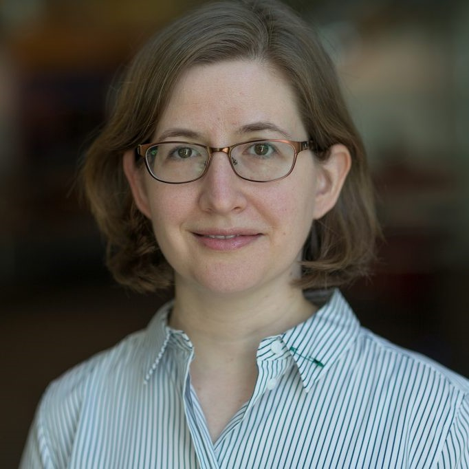

[AAAI-22 UC @ the AAAI site ](https://aaai.org/Conferences/AAAI-22/undergraduate-consortium/)  
Return to [the main AAAI Undergraduate Consortium page](https://aaai-uc.github.io/)

[AAAI 2022 main site](https://aaai.org/Conferences/AAAI-22/)  
Thirty-Sixth AAAI Conference on Artificial Intelligence  
Virtual
February 22 - March 1, 2022

# AAAI-22 Undergraduate Consortium 

## UC-22 Scholars

[Meet our UC-22 scholars!](https://aaai-uc.github.io/2022_scholars.html)

# Program of Events and Invited Talks
## February 22, 2022

## Schedule at-a-glance

<table>
 <thead>
<tr>
<th width="120">Time (PST) </th>
<th>Event</th>
</tr>
</thead>
 <tbody>
  <tr>
   <td width="120">07:30 - 09:00
   </td>
   <td>
    <li>Opening remarks</li>
    <li><a href="https://aaai-uc.github.io/2022_schedule.html#keynote-speaker-amanda-stent">Talk: What Values Matter to AI Researchers?</a> by <a href="https://amandastent.net/">Dr. Amanda Stent</a></li><li>
    Faculty / Industry Panel Q&A</li>
   </td>
  </tr>
  <tr>
   <td>09:00 - 09:15
   </td>
   <td>Break
   </td>
  </tr>
  <tr>
   <td>09:15 - 10:30
   </td>
   <td>UC Scholar Mixer (<strong>UC cohort only</strong>)
   </td>
  </tr>
  <tr>
   <td>10:30 - 12:30
   </td>
   <td>Lunch Break
   </td>
  </tr>
  <tr>
   <td>12:30 - 14:00
   </td>
   <td><li><a href="https://aaai-uc.github.io/2022_schedule.html#keynote-speaker-patricia-ord&oacute;&ntilde;ez">Talk: Ci eS para mí</a> by <a href="https://ccom.uprrp.edu/~pordonez/">Dr. Patricia Ord&oacute;&ntilde;ez</a></li><li>
    Faculty Panel Q&A</li>
   </td>
  </tr>
  <tr>
   <td>14:00 - 14:15
   </td>
   <td>Break
   </td>
  </tr>
  <tr>
   <td>14:15 - 15:00
   </td>
   <td>Grad Student Panel: What is grad school REALLY like? (undergraduate audience only)
   </td>
  </tr>
  <tr>
   <td>15:00 - 16:00
   </td>
   <td>UC Poster Practice Exercise (<strong>UC cohort only</strong>)
   </td>
  </tr>
  <tr>
   <td>16:00 - 16:45
   </td>
   <td>UC Poster Session (<strong>by invitation only</strong>)
   </td>
  </tr>
  <tr>
   <td>16:50 - 17:00
   </td>
   <td>Closing remarks
   </td>
  </tr>
  </tbody>
</table>

## Keynote Speaker: Amanda Stent

### Talk Title  
What Values Matter to AI Researchers?

### Abstract
As AI researchers, we seek the advancement of science or engineering progress. However, other values also drive us as individuals and as groups, including desires to "keep up" or move fast, to achieve recognition, to help others, to encourage diversity, to make money, and so on. Often, these unspoken values drive our priorities. Discussions of values are really discussions about ethics, but I quite frequently hear computer scientists say that we are unqualified to think about ethics, or should not have to think about ethics.  In this talk, I will share some of my values as a researcher over time and give two examples of past research projects of my own where unspoken values either positively or negatively impacted the quality of the research, as well as an example of how my values have changed in response to conversations with other AI researchers. I will raise some questions about what values may be driving the ways in which we currently "do AI" and talk about AI, and share my current thinking about how we can surface all of our values, so that we can have conscious conversations about the scientific choices we make.

### Bio 

Dr. Amanda Stent:

- Is inaugural director of the [Davis Institute for AI at Colby College](https://artificial-intelligence.colby.edu/).
- Previously held positions as the NLP Architect in the Chief Technology Office at Bloomberg, Director of Research and Principal Research Scientist at Yahoo, as Principal Member of Technical Staff at AT&T Labs — Research, and as associate professor in the Computer Science Department at Stony Brook University in Stony Brook, NY.
- Holds a Ph.D. in computer science from the University of Rochester.
- Has authored or co-authored over 100 papers on natural language processing and is co-inventor on over 30 patents.
- Is one of the inaugural editors-in-chief of [ACL Rolling Review](https://aclrollingreview.org/), a board member of [CRA-WP](https://cra.org/cra-wp/) and an [ABET](https://abet.org/) program evaluator. Also currently serves on the National Academies Committee studying [Responsible Computing Research](https://www.nationalacademies.org/our-work/responsible-computing-research-ethics-and-governance-of-computing-research-and-its-applications).

(_UC Chairs' note: This bio has no personal pronouns! From_ [amandastent.net](https://amandastent.net).)

## Keynote Speaker: Patricia Ord&oacute;&ntilde;ez
  
 
### Talk Title 
Ci eS para mí

### Abstract
For many years, I could not see myself as a programmer or computer scientist or any kind of scientist for that matter. I have always been a teacher at heart, but in my mid thirties, technology started to pique my curiosity, in particular AI for medicine. I will share with you my circuitous journey to becoming the first Latina to graduate from the College of Engineering and Information Technology with Ph.D. at the University of Maryland Baltimore County starting at the age of 38 and the first tenured Latina at the University of Puerto Rico Río Piedras in the Department of Computer Science.

### Bio 
Dr. Patricia Ordóñez is an Associate Professor in the Computer Science faculty at the University of Puerto Rico Río Piedras and thereby fulfilling two lifelong and one unexpected midlife dreams -- living in a Spanish speaking country, having the opportunity to make a greater difference in the world, and becoming a professor. Her research interests are in applying machine learning, data mining, and visualization to multivariate time series analysis, specifically to large repositories of clinical data (now known as Biomedical Data Science). She was the first Latina to graduate with a PhD from the College of Engineering and Information Technology at the University of Maryland Baltimore County and the first female Associate Professor to earn tenure in the Computer Science Department at the University of Puerto Rico Río Piedras (UPRRP). She is a former National Science Foundation Graduate Research Fellow. She was co-Chair of the Diversity and Inclusion Council of the Association of Computing Machinery (ACM), and she is serving as General Chair at the 2022 Tapia Celebration of Diversity in Computing Conference. She is the recipient of the Great Minds in STEM 2021 HENAAC Award in Education. She is passionate about creating a more inclusive culture in computing and STEM and about bridging the digital and data divide in global healthcare and education.

# Thanks

Thank you to our speakers, faculty and industry panelists, and graduate student panelists!

## Faculty / Industry Panelists
Mark Díaz, Google  
Judy Goldsmith, University of Kentucky  
Odest Chadwicke Jenkins, University of Michigan  
Elias Khalil, University of Toronto  
Sanmi Koyejo, University of Illinois at Urbana-Champaign  
Pat Morreale, Kean University  
Patricia Ordóñez, University of Puerto Rico Río Piedras  
Jorge Ortiz, Rutgers University   
Anita Raja, Hunter College, City University of New York  
Amanda Stent, Colby College  

## Graduate Student Panelists
Akanksha Atrey, University of Massachusetts Amherst  
Laura Biester, University of Michigan  
De’Aira Bryant, Georgia Institute of Technology  
Jiaoyang Li, University of Southern California   
Thao Nguyen, Brown University  

