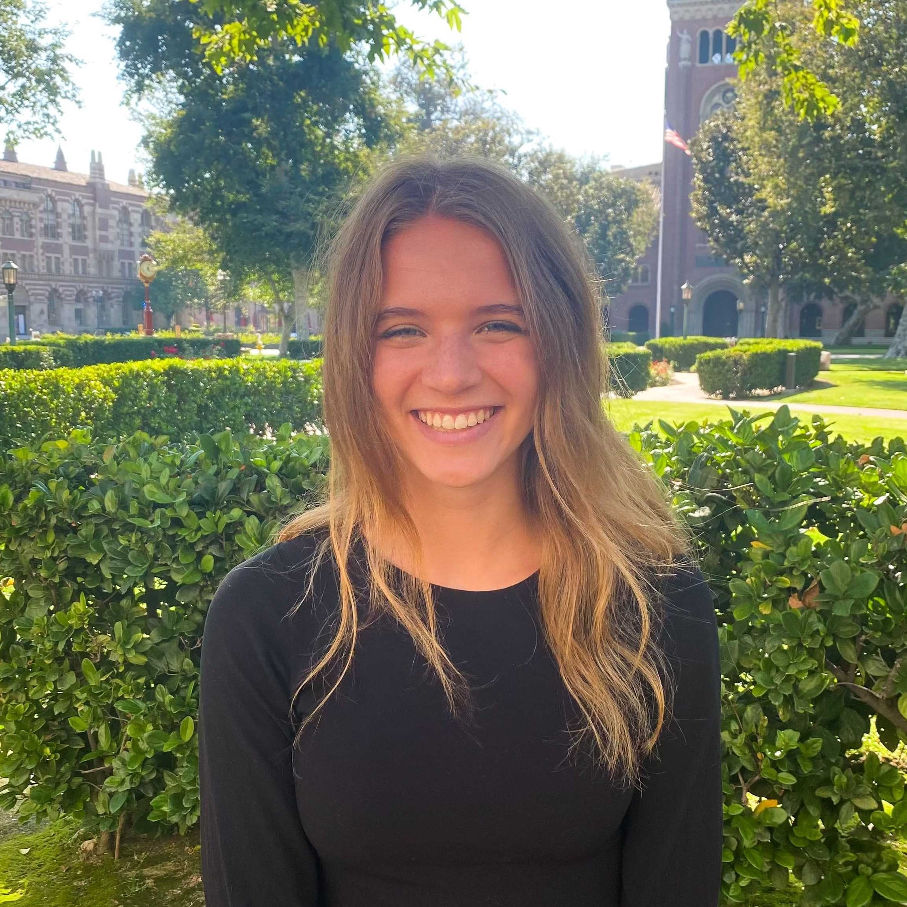

[AAAI-22 UC @ the AAAI site ](https://aaai.org/Conferences/AAAI-22/undergraduate-consortium/)  
Return to [the main AAAI Undergraduate Consortium page](https://aaai-uc.github.io/)

[AAAI 2022 main site](http://aaai.org/Conferences/AAAI-22/)  
Thirty-Sixth AAAI Conference on Artificial Intelligence  
February 22 - March 1, 2022

# AAAI-22 Undergraduate Consortium 

<!--See our AAAI-22 scholars talk about their research! The youtube playlist of AAAI-22 UC pitch videos is [available here](https://www.youtube.com/watch?v=dXsupAQAKgs&list=PLIsth1r16Z2MHJ9jItF2MLGzQgAjH8QN8), and links to individual videos accompany each scholar's profile, below. -->

# Meet our scholars!

## Natalie Abreu
  
Viterbi School of Engineering  
University of Southern California   
<!--[3-min pitch video](https://www.youtube.com/watch?v=b6_19zPghts&list=PLIsth1r16Z2MHJ9jItF2MLGzQgAjH8QN8&index=12)   -->

Natalie is a junior at the University of Southern California studying Computer Science. Her research interests include multi agent systems and machine learning foundations. She works in the Automatic Coordination of Teams Lab, mentored by Eric Ewing and Nora Ayanian. 

### Abstract 
Multi Agent Path Finding (MAPF) is widely needed to coordinate real-world robotic systems. New approaches turn to deep learning to solve MAPF instances, primarily using reinforcement learning, which has high computational costs. We propose a supervised learning approach to solve MAPF instances using a smaller, less costly model.

## Vishakha Agrawal
  
Department of Information Science and Engineering   
Dayananda Sagar College of Engineering   
[https://vishakha-a.github.io/](https://vishakha-a.github.io)  
<!--[3-min pitch video](https://www.youtube.com/watch?v=0E2jPSKyNQk&list=PLIsth1r16Z2MHJ9jItF2MLGzQgAjH8QN8&index=7)   -->

I am a senior undergraduate student majoring in information science. Upon the completion of my undergraduate degree, I plan to pursue a Ph.D. in computer science. My research interests and experiences lie within the broad area of trustworthy machine learning. More specifically, my research spans explainable, fair, and robust ML. I am also very interested in AI ethics and algorithmic justice. In my free time, I enjoy hiking, napping, and attending conferences.

### Abstract 
In recent times, the social credit systems (SCS) and similar mass surveillance systems driven by AI have been deployed by the Chinese government in various regions. However, the discussions around the SCS are ambiguous, wherein, some people call them very controversial and a breach of human rights and other people say that the SCS and related surveillance systems are very similar in structure to the normal credit systems in the United States. In reality, though, there is no monolith and there are various different forms of mass surveillance and SCS deployed in different regions of China. In this paper, I review and analyse the different models of the SCS in different areas of China. Then, I compare how the different systems are upholding or breaching China’s own AI Ethics guidelines. This work will contribute to the broader goal of the AI community in addressing concerns about AI-driven decision-making that stems from the use cases of technologies such as computer vision and their potential for policing, social control, and surveillance by both state and corporate interests. 

## Kaleab Belete Belay
   
School of Information Technology and Engineering (SiTE)  
Addis Ababa Institute of Technology   
<!--[3-min pitch video](https://www.youtube.com/watch?v=2UVLACiXnM0&list=PLIsth1r16Z2MHJ9jItF2MLGzQgAjH8QN8&index=14)   -->

My name is Kaleab and I am a Software Engineering major with a passion for AI and Robotics. I believe AI and Robotics can be applied in developing countries to accelerate progress towards development. Making AI more affordable for use in low-resource environments is also an area of interest I am interested in. 

### Abstract 
Deep Neural Networks have memory and computational demands that often render them difficult to use in low-resource environments. Also, highly dense networks are over-parameterized and thus prone to overfitting. To address these problems, we introduce a novel algorithm that prunes (sparsifies) weights from the network by taking into account their magnitudes and gradients taken against a validation dataset. Unlike existing pruning methods, our method does not require the network model to be retrained once initial training is completed. On the CIFAR-10 dataset, our method reduced the number of paramters of MobileNet by a factor of 9X, from 14 million to 1.5 million, with just a 3.8% drop in accuracy.

## Hannah M. Claus
  
School of Computer Science and Technology   
University of Bedfordshire   
[https://www.linkedin.com/in/hannah-claus-042382199/](https://www.linkedin.com/in/hannah-claus-042382199/)   
<!--[3-min pitch video](https://www.youtube.com/watch?v=eyRyz5ltcco&list=PLIsth1r16Z2MHJ9jItF2MLGzQgAjH8QN8&index=4)   -->

Hannah M. Claus is a senior undergraduate pursuing a Bachelor of Science in Artificial Intelligence and Robotics at the University of Bedfordshire. She started programming at the age of 13 when she was the only girl in the Computer Science class at school. After receiving a scholarship by the Hasso-Plattner-Institute twice, where she could visit university lectures and deepen her knowledge on Software Engineering, she got the opportunity to study at the Technical University Berlin while still going to school. After those four years of simultaneously visiting university and school, she graduated at the age of 18 and decided to deepen her studies of AI and Robotics abroad in the UK. During her studies she is also working voluntarily for various organisations that support women and people of colour in STEM areas. Hannah is a published researcher and is working towards the goal to give more girls and women all around the world the opportunity to excel in STEM by making knowledge more accessible. As part of a research team of the German Aerospace Center (DLR), she is currently working on creating machine learning classifiers that detect and classify collisions for the humanoid robot Rollin' Justin to extend the applications of robots in space exploration.

### Abstract 
This paper explores the importance of using optimisation techniques when tuning a machine learning model. The hyperparameters that need to be determined for the Artificial Neural Network (ANN) to work most efficiently, are supposed to find a value that achieves the highest recognition accuracy in a face recognition application. First, the model was trained without an optimisation technique. The highest recognition accuracy that could be achieved was 96.6% with a specific set of parameters used in the ANN. However, the error rate was at 30%, which was not optimal. After utilising Grid Search as the first tuning method for hyperparameters, the recognition accuracy rose to 96.9% and the error rate could be minimised to be less than 1%. Applying Random Search, a recognition accuracy of 98.1% could be achieved with the same error rate. Hence, the accuracy of the facial recognition application could be increased by at least 2.1% by applying automated optimisation algorithms. Furthermore, this paper will also deal with common issues in face recognition (i.e. racial bias and gender bias) and focus on potential solutions. 

## Amelia Lee Dogan
  
Department of Urban Studies and Planning and Department of Electrical Engineering and Computer Science  
Massachusetts Institute of Technology  
<!--[3-min pitch video](https://www.youtube.com/watch?v=XkU9ZXvMJtU&list=PLIsth1r16Z2MHJ9jItF2MLGzQgAjH8QN8&index=10)   -->

Amelia Lee Dogan (she/they) is an undergraduate student studying Urban Planning with Computer Science and American Studies at the Massachusetts Institute of Technology. Currently, she works at the Data + Feminism Lab researching data activism. Previously, they have worked at Google, the US Department of Transportation Volpe Center, West Philadelphia Landscape Project, and Movement Alliance Project/Vietlead. Her research interests primarily examine how communitie of color use data science for co-liberation. She’s from occupied Lenape land (Philadelphia/NYC) and Coast Salish territories (Vancouver). 

### Abstract 
After criminal recidivism or hiring machine learning models have inflicted harm, participatory machine learning methods are often used as a corrective positioning. However, little guidance exists on how to develop participatory machine learning models in a ground-up format. Here we demonstrate how to co-design and partner with community groups, in the specific case of feminicide data activism. We co-designed and piloted a machine learning model for the detection of feminicide media articles. This provides an intersectional feminist perspective on practicing participatory methods in a co-creation mindset for the real-world scenario of feminicide monitoring.

## Willa Potosnak
  
Biomedical Engineering   
Duquesne University   
[https://www.linkedin.com/in/willa-potosnak-4679b119a/](https://www.linkedin.com/in/willa-potosnak-4679b119a/)   
<!--[3-min pitch video](https://www.youtube.com/watch?v=drKqN1h3VVE&list=PLIsth1r16Z2MHJ9jItF2MLGzQgAjH8QN8&index=13)   -->

Willa Potosnak is a senior biomedical engineering major at Duquesne University. She works in the Auton Lab at Carnegie Mellon University under the mentorship of Dr. Artur Dubrawski and Dr. Kyle Miller. She is currently researching methods to improve machine learning (ML) model integrity and interpretability with the objective of ensuring the reliable implementation of artificial intelligence (AI) in practice. Among her research goals is to improve ML methods that are used to aid diagnostics and early event detection. She is also interested in research that supports protecting data privacy and security to promote distributed frameworks which can facilitate knowledge transfer between institutions. After obtaining her undergraduate degree, she intends to obtain a doctoral degree in ML research aimed at improving AI systems to enhance people’s quality of life.

### Abstract 
Transferring expertise and knowledge across sites has been demonstrated to improve the quality of practices and outcomes across sites. However, understanding the subpopulations for whom knowledge transfers would yield potential benefit is also necessary as not all externally derived knowledge may be applicable to an entire population of interest. We propose an algorithmic rule selection approach which aims to select a short list of human-interpretable rules that reliably identify subpopulation beneficiaries of knowledge transfers in the form of machine learning risk models. Our experimental results, obtained with two intensive care monitoring datasets, demonstrate the potential utility of the proposed method in practice.

## Wes Robbins 
  
Computer Science   
Montana State University   
[http://wes-robbins.xyz](http://wes-robbins.xyz/)   
<!--[3-min pitch video](https://www.youtube.com/watch?v=dXsupAQAKgs&list=PLIsth1r16Z2MHJ9jItF2MLGzQgAjH8QN8&index=1)   -->

Wes Robbins is pursuing a Bachelor of Science in Computer Science at Montana State University. His research interests include deep learning, computer vision, and fusing input from multiple modalities. Wes was an intern at the Language Information and Computation Lab at the University of Colorado, Colorado Springs where he worked at the intersection of NLP and Computer Vision.

### Abstract 
While text generated by current vision-language models may be accurate and syntactically correct, it is often general.  Recent work has used optical character recognition to supplement visual information with text extracted from an image. In many cases, using text in the image improves the specificity and usefulness of generated text. We contend that vision-language models can benefit from additional information extracted from an image. We modify previous multimodal frameworks to accept relevant information from a number of auxiliary classifiers. In particular, we focus on person names as an additional set of tokens and create a novel image-caption dataset to facilitate captioning with person names. The dataset, Politicians and Athletes in Captions (PAC), consists of captioned images of well-known people in context. By fine-tuning pretrained models with this dataset, we demonstrate a model that can naturally integrate facial recognition tokens into generated text by training on limited data.

## Eshika Saxena
  
School of Engineering and Applied Sciences   
Harvard University   
<!--[3-min pitch video](https://www.youtube.com/watch?v=aSiSyynzXeE&list=PLIsth1r16Z2MHJ9jItF2MLGzQgAjH8QN8&index=6)   -->

Eshika is a junior at Harvard majoring in Computer Science. She has worked on research involving the application of machine learning to radiology and disease diagnostics for the past five years. She is interested in the intersection of computer science, artificial intelligence, and medicine. In her free time, she enjoys dancing, baking, and traveling.

### Abstract 
Breast reconstruction surgery requires extensive planning, usually with a CT scan that helps surgeons identify which vessels are suitable for harvest. Currently, there is no quantitative method for preoperative planning. In this work, we successfully develop a deep learning algorithm to segment the vessels within the region of interest for breast reconstruction. Ultimately, this information will be used to determine the optimal reconstructive method (choice of vessels, extent of the free flap/harvested tissue) to reduce intra- and postoperative complication rates. This approach has the ability to considerably shorten operating times and lower healthcare costs.

## Ashley Schuliger
  
Department of Computer Science  
Worcester Polytechnic Institute   
<!--[3-min pitch video](https://www.youtube.com/watch?v=FYjli9KpEmM&list=PLIsth1r16Z2MHJ9jItF2MLGzQgAjH8QN8&index=8)   -->

Ashley Schuliger is an undergraduate at Worcester Polytechnic Institute, pursuing her combined Bachelor's and Masters degrees in Computer Science and Data Science. Her current research involves solving materials science problems utilizing data-driven solutions, such as multiple-instance learning. 

### Abstract 
Cold Spray Additive Manufacturing is an emerging technology utilized to build components with complex geometries. This technology has been widely adopted in various applications, including the repair of military vehicles and equipment, to improve efficiency and save resources. However, the behavior of a powder during cold spray processing varies depending upon its properties, namely its flowability. Currently, researchers do not fully understand the quantitative impact of a powder's properties on its Hall Flow rate. Thus, we developed a Multiple-Instance Regression framework to predict the flowability of a powder based on various properties of the underlying particles.

## Abigail Swenor
  
Department of Computer Science   
University of Colorado - Colorado Springs   
<!--[3-min pitch video](https://www.youtube.com/watch?v=O1Ud9TTHFtw&list=PLIsth1r16Z2MHJ9jItF2MLGzQgAjH8QN8&index=11)   -->

Abigail Swenor is an undergraduate student at the University of Colorado - Colorado Springs (UCCS) majoring in computer science with minors in mathematics, computer engineering, and philosophy. She is an undergraduate researcher for the Language Information and Computation Lab at UCCS. Her research interests are in Natural Language Processing (NLP) and Machine Learning, and she is currently working with defense methods for adversarial attacks on NLP models. Abigail plans to pursue a PhD in computer science after completing her undergraduate studies at UCCS. 

### Abstract 
Deep learning models have excelled in solving many difficult problems in Natural Language Processing (NLP), but it has been demonstrated that such models are susceptible to extensive vulnerabilities. We offer a solution to this vulnerability by using, during testing, random perturbations such as spelling correction if necessary, substitution by random synonym, or simply dropping the word. These perturbations are applied to random words in random sentences to defend NLP models against adversarial attacks. Our Random Perturbations Defense and Increased Randomness Defense methods are successful in returning attacked models to their original accuracy within statistical significance. 

## Mira Welner
  
Electrical and Computer Engineering   
University of California, Davis   
[burningsilicon.dev](https://burningsilicon.dev)   
<!--[3-min pitch video](https://www.youtube.com/watch?v=3JrT1o2ICKs&list=PLIsth1r16Z2MHJ9jItF2MLGzQgAjH8QN8&index=3)   -->

I am a senior at UC Davis and hope to get a PhD in computer vision and robotics. For three years I have worked at prosthetics and robotics lab designing user studies to study the muscular motions of young children. For two years I have worked in a machine learning lab studying what factors will cause a study to translate from preclinical to clinical succesfully. Last summer I worked with Professor Aswin Sankarankarayanan studyign hyperspectral images at Carnegie Mellon University. I hope to apply machine learning and computer vision to space travel.

### Abstract 
We introduce a novel technique to identify the three primary materials in a scene as displayed by a hyperspectral image using unsupervised learning. We designed a modified autoencoder which compresses the hyperspectral image using convolutional neural networks, but unlike most autoencoders, decompresses the images using linear algebra. This ensures that unlike standard the latent features of the compressed images contain data understandable by humans. The linear algebra used for decompression relies on the properties of hyperspectral images. The resulting three spectra are intended to resemble the spectra of the actual materials in the scene but further research is necessary to determine if this is true. 

## Funing Yang
  
Department of Computer Science   
Wellesley College  
<!--[3-min pitch video](https://www.youtube.com/watch?v=TPHgUXT0Ink&list=PLIsth1r16Z2MHJ9jItF2MLGzQgAjH8QN8&index=2)   -->

Funing is a senior majoring in computer science and English at Wellesley College. Given her interdisciplinary background, Funing is passionate to apply her computational skills to the humanities and social sciences with a strong interest in Natural Language Processing and computational linguistics. Funing has served as a research assistant at MIT Digital Humanities Lab developing various dynamic web apps for humanities scholars’ research needs, and at MIT CSAIL to advance AI for K-12 education with interactive conversational AI modules, and at Wellesley College Cred Lab for data mining projects that analyze the credibility of news sources at scale with modeling. Funing is currently working on her senior thesis on NLP and computational narrative understanding, and hopes to pursue a career in AI research in the future.  

### Abstract 
My research presents an end-to-end pipeline for literary character identification and ongoing work for extracting and comparing representations for literary characters based on events and speech. The character identification pipeline involves a named entity recognition (NER) module, a coreference-resolution module, and a disambiguation module using both state-of-the-art neural network architectures and algorithmic approaches. Ongoing work compares event extraction pipeline,  a character speech extraction module, and novel evaluation and comparison metrics for dense vector representations for literary characters representations with case studies. The project contributes to computational narrative understanding through developing modular pipelines for automated character extraction as well as representation for literary texts that are generalizable to textual analysis in diverse domains.
