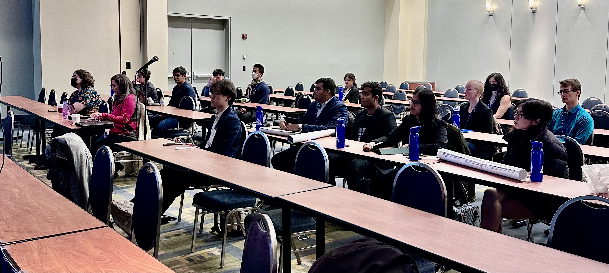

[AAAI-23 UC @ the AAAI site ](https://aaai.org/Conferences/AAAI-23/undergraduate-consortium/)  
Return to [the main AAAI Undergraduate Consortium page](https://aaai-uc.github.io/)

[AAAI 2023 main site](https://aaai.org/Conferences/AAAI-23/)  
Thirty-Seven AAAI Conference on Artificial Intelligence  
February 7 - February 14, 2023

# AAAI-23 Undergraduate Consortium 

## UC-23 Scholars

[Meet our UC-23 scholars!](https://aaai-uc.github.io/2023_scholarsDRAFT.html)

# Program of Events and Invited Talks
## February 7, 2023

## Schedule at-a-glance 

## February 7, 2023(Room 209BC)
<table>
 <thead>
<tr>
<th width="140">Time (EST) </th>
<th>Event</th>
</tr>
</thead>
 <tbody>
  <tr>
   <td width="130">08:00 - 08:45
   </td>
   <td>
    Logistics and Registration
    <ul>
     <li>Elaine Short, Tufts University</li>
     <li>Patricia Ordóñez, University of Maryland Baltimore County</li>
    </ul> 
   </td>
  </tr>
  <tr>
   <td width="140">08:45 - 09:30
   </td>
   <td>
    <b>Keynote: </b>
    <a href="https://aaai-uc.github.io/2023_schedule.html#Keynote-Speaker:-Dr.-Holly-Yanco">Designing Robots for Humans</a> by <a href="https://www.cs.uml.edu/~holly/">Dr. Holly Yanco</a>
   </td>
  </tr>
   <tr>
   <td width="140">09:30 - 10:30
   </td>
   <td>
    How to apply to graduate school and fund your graduate education
    <ul>
     <li>Elaine Short, Tufts University</li>
     <li>Patricia Ordóñez, University of Maryland Baltimore County</li>
    </ul> 
   </td>
  </tr>
  <tr>
   <td>10:30 - 11:00
   </td>
   <td>Coffee Break
   </td>
  </tr>
  <tr>
   <td>11:00 - 11:45
   </td>
   <td>How to write a winning personal statement
    <ul>   
     <li>Patricia Ordóñez, University of Maryland Baltimore County</li> 
    </ul>
   </td>
  </tr>
  <tr>
   <td>11:45 - 13:00
   </td>
   <td>Beat the lunch rush
   </td>
  </tr>
  <tr>
   <td>13:00 - 14:00
   </td>
   <td>
    Faculty panel & speed-mentoring  
    <ul>
     <li>Feras Batarseh, Virginia Tech University </li>
     <li>Brianna Posadas, Virginia Tech University</li>
     <li>Patricia Ordóñez, University of Maryland Baltimore County</li>
     <li>Jorge Ortiz, Rutgers University</li>
     <li>Elaine Short, Tufts University</li>
     <li>Eliana Valenzuela, University of Puerto Rico at Arecibo</li>
    </ul>
   </td>
  </tr>
  <tr>
   <td>14:00 - 14:45
   </td>
   <td>
    How to make a good research pitch and write an excellent research statement when you are not sure of what you wanna do
    <ul>
     <li>Jorge Ortiz, Rutgers University</li>
    </ul>
   </td>
  </tr>
  <tr>
   <td>14:45 - 15:15
   </td>
   <td>Coffee Break
   </td>
  </tr>
  <tr>
   <td>15:15 - 16:00
   </td>
   <td>
    <b>Keynote: </b>
    <a href="https://aaai-uc.github.io/2023_schedule.html#Keynote-Speaker:-Dr.-Cecilia-Aragon">What is Human-Centered AI and Why Does It Matter?</a> by <a href="http://CeciliaAragonAuthor.com">Dr. Cecilia Aragón</a>
   </td>
  </tr>
  <tr>
   <td>16:00 - 17:00
   </td>
   <td> 
    Student Poster Session
   </td>
  </tr>
  <tr>
   <td>17:00 - 17:15
   </td>
   <td> 
    Closing Remarks
     <li>Patricia Ordóñez, University of Maryland Baltimore County</li>
   </td>
  </tr>
  <tr>
   <td>18:00 
   </td>
   <td>
    AAAI Student Reception 
   </td>
  </tr>
  </tbody>
</table>

## February 8, 2023 (Marriot Marquis Hotel Lobby)

<table>
 <thead>
<tr>
<th width="140">Time (EST) </th>
<th>Event</th>
</tr>
</thead>
 <tbody>
  <tr>
   <td width="130">10:00 
   </td>
   <td>
     Networking+ [more info](https://docs.google.com/document/d/1zMYbAwXeT7opixEypoQ-a96BZqFCoTm8jY6MN-myWVo/edit)
    <ul>
     <li>Jason Grant, Villanova University</li>
    </ul> 
   </td>
  </tr>
  </table>

## Keynote Speaker: Dr. Holly Yanco

 
### Talk Title 
Designing Robots for Humans

### Abstract
All robots interact with people in some way. Robots navigating in difficult and dynamic environments often need assistance from human operators or supervisors, either in the form of teleoperation or interventions when the robot's autonomy is not able to handle the current situation. Even in more controlled environments, such as office buildings and manufacturing floors, robots may need help from people. As robots become more autonomous and ubiquitous, people will become bystanders to the systems, with little knowledge of the robot’s intent. This talk will focus on the design of human-robot interaction for a wide variety of applications, ranging from assistive technology to telepresence to exoskeletons to humanoid robots. 

### Bio 
Dr. Holly Yanco is a Distinguished University Professor, Head of the Richard A. Miner School of Computer & Information Sciences, and Director of the New England Robotics Validation and Experimentation (NERVE) Center at the University of Massachusetts Lowell. Her research interests include human-robot interaction, evaluation metrics and methods for robot systems, and the use of robots in K-12 education to broaden participation in computer science. Yanco's research has been funded by NSF, including a CAREER Award, the Advanced Robotics for Manufacturing (ARM) Institute, ARO, DARPA, DOE-EM, ONR, NASA, NIST, Google, Microsoft, and Verizon. She is a member of the Computing Research Association’s Computing Community Consortium, served as Co-Chair of the Steering Committee for the ACM/IEEE International Conference on Human-Robot Interaction from 2013-2016 and was a member of the Executive Council of the Association for the Advancement of Artificial Intelligence (AAAI) from 2006-2009 Yanco has a PhD and MS in Computer Science from the Massachusetts Institute of Technology and a BA in Computer Science and Philosophy from Wellesley College. She is a AAAI Fellow.

More [information](https://www.cs.uml.edu/~holly/) 

## Keynote Speaker: Dr. Cecilia Aragon

### Talk Title  
What is Human-Centered AI and Why Does It Matter?

### Abstract
While extraordinary advances in our ability to collect, analyze, and interpret vast amounts of data have been transforming the fundamental nature of artificial intelligence (AI), the human aspects of  artificial intelligence, including how to support scientific creativity and human insight, how to address ethical concerns, and the consideration of societal impacts, have been less studied. Yet these human issues are becoming increasingly vital to the future of AI. I will reflect on a 30-year career in data science and AI in industry, government, and academia, discuss what it means for AI to be both rigorous and human-centered, and speculate upon future directions for data science and AI.

### Bio 

Dr. Cecilia Aragón is an award-winning author, airshow pilot, and the first Latina to earn the rank of Full Professor in the College of Engineering at the University of Washington in its 100-year history. She’s worked with Nobel Prize winners and has taught astronauts to fly. Her innovative research, and a stint at NASA designing software for Mars missions, led President Obama to call her “one of the top scientists and engineers in the country.” In addition to her love of math and science, she’s passionate about helping others face their own fears and challenges to achieve their goals.

Her award-winning memoir, [Flying Free (2020)](https://ceciliaaragonauthor.com/flying-free/), shares her journey of breaking past her own fears to become a champion aerobatic pilot. It debuted on five bestseller lists and is a TODAY Show and Hip Latina Recommended Read. Her 2019 book, [Writers in the Secret Garden](https://ceciliaaragonauthor.com/writers-in-the-secret-garden-2/), takes a close look at the fascinating world of fanfiction to explore how young people express themselves. Her latest book, [Human-Centered Data Science (2022)](https://ceciliaaragonauthor.com/human-centered-data-science/), is an accessible guide to best practices for addressing bias and inequality in data science and artificial intelligence. Learn more at [CeciliaAragonAuthor.com.](http://CeciliaAragonAuthor.com)

# Thanks

Thank you to our speakers, faculty panelists!

<!--- ## Faculty / Industry Panelists

## Graduate Student Panelists -->

