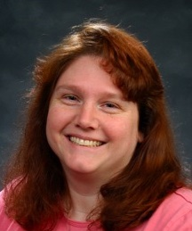
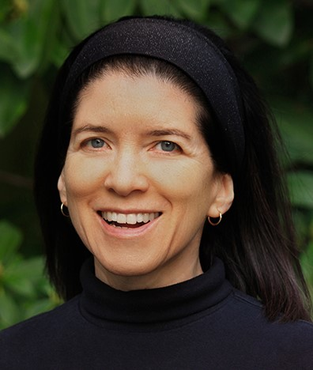

[AAAI-23 UC @ the AAAI site ](https://aaai.org/Conferences/AAAI-23/undergraduate-consortium/)  
Return to [the main AAAI Undergraduate Consortium page](https://aaai-uc.github.io/)

[AAAI 2023 main site](https://aaai.org/Conferences/AAAI-23/)  
Thirty-Seven AAAI Conference on Artificial Intelligence  
February 7 - February 14, 2023

# AAAI-22 Undergraduate Consortium 

## UC-23 Scholars

[Meet our UC-23 scholars!](https://aaai-uc.github.io/2023_scholarsDRAFT.html)

# Program of Events and Invited Talks
## February 7, 2023

## Schedule at-a-glance (Room 209BC)

<table>
 <thead>
<tr>
<th width="140">Time (PST) </th>
<th>Event</th>
</tr>
</thead>
 <tbody>
  <tr>
   <td width="140">08:00 - 08:15
   </td>
   <td>
    <li>Opening remarks</li>
   </td>
  </tr>
  <tr>
   <td width="140">08:15 - 9:25
   </td>
   <td>
    <a href="https://aaai-uc.github.io/2023_schedule.html#Keynote-Speaker:-Dr.-Holly-Yanco">TBD</a> by <a href="https://www.cs.uml.edu/~holly/">Dr. Holly Yanco</a>
   </td>
  </tr>
   <tr>
   <td width="140">09:30 - 10:30
   </td>
   <td>
    How to apply to graduate school and fund your graduate education
   </td>
  </tr>
  <tr>
   <td>10:30 - 11:00
   </td>
   <td>Coffe Break
   </td>
  </tr>
  <tr>
   <td>11:00 - 11:45
   </td>
   <td>How to write a winning personal statement
   </td>
  </tr>
  <tr>
   <td>11:45 - 13:00
   </td>
   <td>Beat the lunch rush
   </td>
  </tr>
  <tr>
   <td>13:00 - 14:00
   </td>
   <td>
    Faculty and graduate student panel & speed-mentoring
   </td>
  </tr>
  <tr>
   <td>14:00 - 14:45
   </td>
   <td>
    How to make a good research pitch and write an excellent research statement when you are not sure of what you wanna do.
   
   </td>
  </tr>
  <tr>
   <td>14:45 - 15:15
   </td>
   <td>Coffe Break
   </td>
  </tr>
  <tr>
   <td>15:15 - 16:00
   </td>
   <td>
    <a href="https://aaai-uc.github.io/2023_schedule.html#Keynote-Speaker:-Dr.-Cecilia-Aragon">What is Human-Centered AI and Why Does It Matter?</a> by <a href="http://CeciliaAragonAuthor.com">Dr. Cecilia Aragón</a>
   </td>
  </tr>
  <tr>
   <td>16:00 - 17:00
   </td>
   <td> 
    Student Poster Session
   </td>
  </tr>
  <tr>
   <td>18:00 
   </td>
   <td>
    Student Reception<\br>
    Closing remarks
   </td>
  </tr>
  </tbody>
</table>

## Keynote Speaker: Dr. Holly Yanco

 
### Talk Title 
TBD

### Abstract
TBD

### Bio 
Holly Yanco is a Professor in the Computer Science Department at UMass Lowell, joining the faculty in July 2001. She is also the director of the New England Robotics Validation and Experimentation (NERVE) Center.

She founded the Human-Robot Interaction Lab which consists of students at all stages of their careers, from freshmen to doctoral candidates. Dr. Yanco's research interests include human-robot interaction, better visualization of sensor data, adjustable autonomy, urban search and rescue, assistive technology, and robotics education. Her lab is funded by the National Science Foundation, the Army Research Office, Microsoft and the National Institute of Standards and Technology.

Dr. Yanco co-developed the Artbotics program, which combines art and computer science in a curriculum for high school and college students. She was the PI of the NSF-funded (DUE-0231363) development of Pyro, a Python-based robotics curriculum, which was selected as the Premier Courseware of 2005 by NEEDS. She has received teaching awards from UMass Lowell and MIT.

She is the General Chair of the 2012 ACM/IEEE International Conference on Human-Robot Interaction. She has served on the Executive Council of the Association for the Advancement of Artificial Intelligence (2006-2009), as the Symposium Chair for AAAI (2002-2005) and as the Exhibition Co-Chair of the ACM/IEEE Conference on Human-Robot Interaction (2007-2009).

More [information](https://www.cs.uml.edu/~holly/) 

## Keynote Speaker: Dr. Cecilia Aragon

### Talk Title  
What is Human-Centered AI and Why Does It Matter?

### Abstract
While extraordinary advances in our ability to collect, analyze, and interpret vast amounts of data have been transforming the fundamental nature of artificial intelligence (AI), the human aspects of  artificial intelligence, including how to support scientific creativity and human insight, how to address ethical concerns, and the consideration of societal impacts, have been less studied. Yet these human issues are becoming increasingly vital to the future of AI. I will reflect on a 30-year career in data science and AI in industry, government, and academia, discuss what it means for AI to be both rigorous and human-centered, and speculate upon future directions for data science and AI.

### Bio 

DR. CECILIA ARAGON is an award-winning author, airshow pilot, and the first Latina to earn the rank of Full Professor in the College of Engineering at the University of Washington in its 100-year history. She’s worked with Nobel Prize winners and has taught astronauts to fly. Her innovative research, and a stint at NASA designing software for Mars missions, led President Obama to call her “one of the top scientists and engineers in the country.” In addition to her love of math and science, she’s passionate about helping others face their own fears and challenges to achieve their goals.

Her award-winning memoir, [Flying Free (2020)](https://ceciliaaragonauthor.com/flying-free/), shares her journey of breaking past her own fears to become a champion aerobatic pilot. It debuted on five bestseller lists and is a TODAY Show and Hip Latina Recommended Read. Her 2019 book, [Writers in the Secret Garden](https://ceciliaaragonauthor.com/writers-in-the-secret-garden-2/), takes a close look at the fascinating world of fanfiction to explore how young people express themselves. Her latest book, [Human-Centered Data Science (2022)](https://ceciliaaragonauthor.com/human-centered-data-science/), is an accessible guide to best practices for addressing bias and inequality in data science and artificial intelligence. Learn more at [CeciliaAragonAuthor.com.](http://CeciliaAragonAuthor.com)

## Keynote Speaker: Patricia Ord&oacute;&ntilde;ez
  
 
### Talk Title 
Ci eS para mí

### Abstract
For many years, I could not see myself as a programmer or computer scientist or any kind of scientist for that matter. I have always been a teacher at heart, but in my mid thirties, technology started to pique my curiosity, in particular AI for medicine. I will share with you my circuitous journey to becoming the first Latina to graduate from the College of Engineering and Information Technology with Ph.D. at the University of Maryland Baltimore County starting at the age of 38 and the first tenured Latina at the University of Puerto Rico Río Piedras in the Department of Computer Science.

### Bio 
Dr. Patricia Ordóñez is an Associate Professor in the Computer Science faculty at the University of Puerto Rico Río Piedras and thereby fulfilling two lifelong and one unexpected midlife dreams -- living in a Spanish speaking country, having the opportunity to make a greater difference in the world, and becoming a professor. Her research interests are in applying machine learning, data mining, and visualization to multivariate time series analysis, specifically to large repositories of clinical data (now known as Biomedical Data Science). She was the first Latina to graduate with a PhD from the College of Engineering and Information Technology at the University of Maryland Baltimore County and the first female Associate Professor to earn tenure in the Computer Science Department at the University of Puerto Rico Río Piedras (UPRRP). She is a former National Science Foundation Graduate Research Fellow. She was co-Chair of the Diversity and Inclusion Council of the Association of Computing Machinery (ACM), and she is serving as General Chair at the 2022 Tapia Celebration of Diversity in Computing Conference. She is the recipient of the Great Minds in STEM 2021 HENAAC Award in Education. She is passionate about creating a more inclusive culture in computing and STEM and about bridging the digital and data divide in global healthcare and education.

# Thanks

Thank you to our speakers, faculty and industry panelists, and graduate student panelists!

## Faculty / Industry Panelists
Mark Díaz, Google  
Judy Goldsmith, University of Kentucky  
Odest Chadwicke Jenkins, University of Michigan  
Elias Khalil, University of Toronto  
Sanmi Koyejo, University of Illinois at Urbana-Champaign  
Patricia Morreale, Kean University  
Patricia Ordóñez, University of Puerto Rico Río Piedras  
Jorge Ortiz, Rutgers University   
Anita Raja, Hunter College, City University of New York  
Pablo Rivas, Baylor University  
Amanda Stent, Colby College  

## Graduate Student Panelists
Akanksha Atrey, University of Massachusetts Amherst  
Laura Biester, University of Michigan  
De’Aira Bryant, Georgia Institute of Technology  
Jiaoyang Li, University of Southern California   
Thao Nguyen, Brown University  

