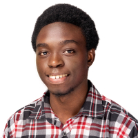
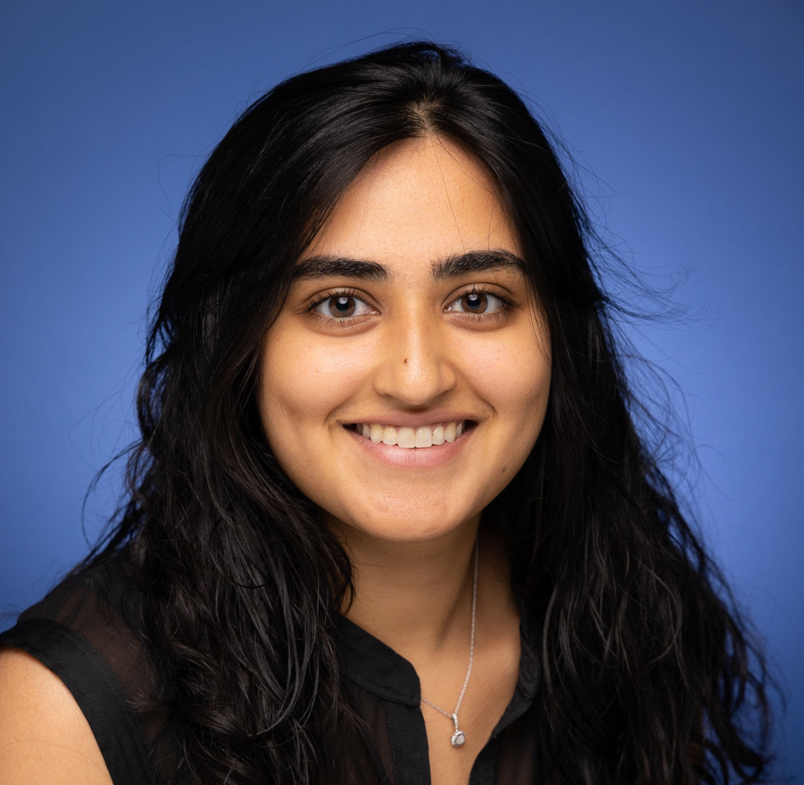
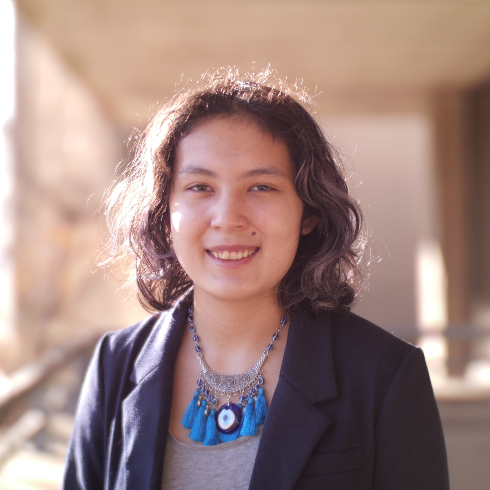
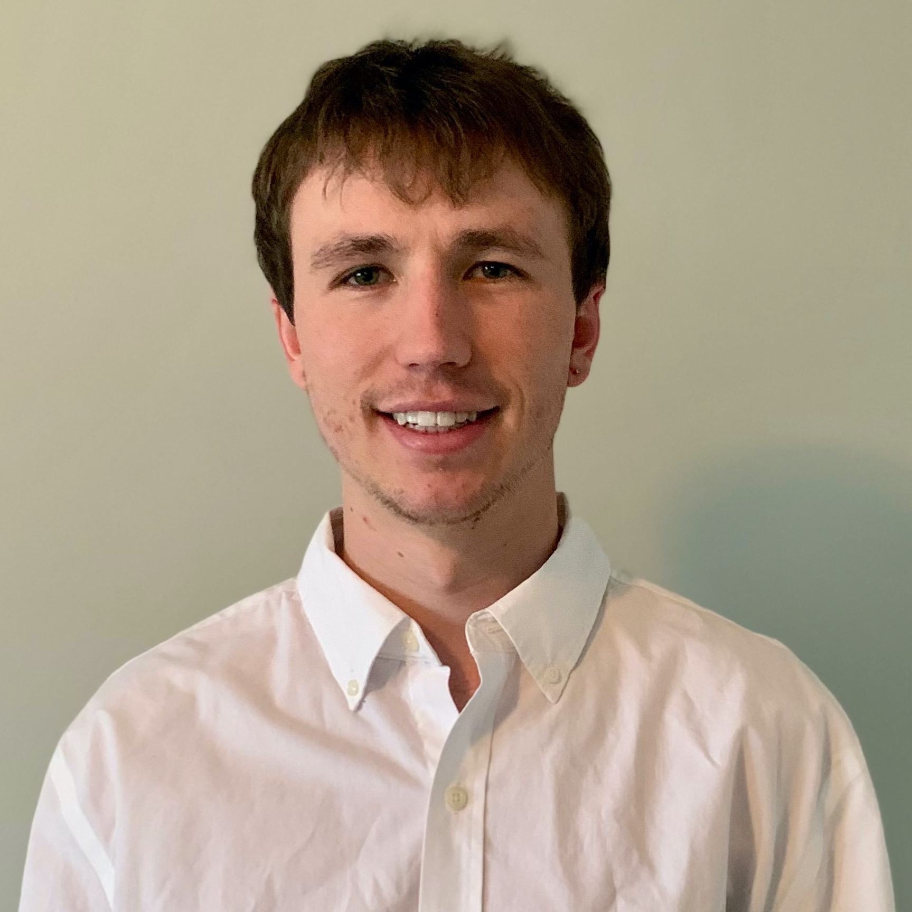
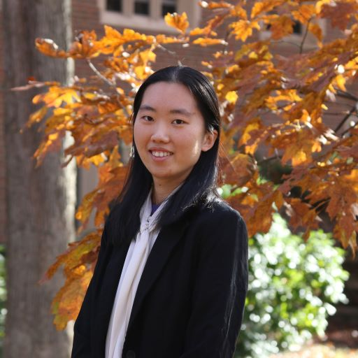

[AAAI-23 UC @ the AAAI site ](https://aaai.org/Conferences/AAAI-23/undergraduate-consortium/)  
Return to [the main AAAI Undergraduate Consortium page](https://aaai-uc.github.io/)

[AAAI 2022 main site](https://aaai.org/Conferences/AAAI-23/)  
Thirty-Seventh AAAI Conference on Artificial Intelligence  
February 7 - February 14, 2023

# AAAI-23 Undergraduate Consortium 

<!--See our AAAI-22 scholars talk about their research! The youtube playlist of AAAI-22 UC pitch videos is [available here](https://www.youtube.com/watch?v=dXsupAQAKgs&list=PLIsth1r16Z2MHJ9jItF2MLGzQgAjH8QN8), and links to individual videos accompany each scholar's profile, below. -->

# Meet our scholars!

## Kaihua (William) Hou
  
Electrical Engineering and Computer Science Departments  
Johns Hopkins University  

<!--[3-min pitch video](https://www.youtube.com/watch?v=b6_19zPghts&list=PLIsth1r16Z2MHJ9jItF2MLGzQgAjH8QN8&index=12)   -->

Kaihua (William) Hou is an undergraduate student studying Electrical Engineering and Computer Science at Johns Hopkins University. He works at the JHU Malone Center for Engineering in Healthcare under the mentorship of Dr. Mathias Unberath and Dr. Jithin Yohannan. He is also a visiting research assistant at the Massachusetts Institute of Technology, advised by Dr. John Guttag. His research interests lie at the intersection of machine learning, equitable healthcare, and clinical decision-making.

### Abstract 
Visual fields (VF) and optical coherence tomography (OCT) are two commonly used eye exams to diagnose glaucoma and track its worsening. However, two clinicians each examining a different test of the same patient may arrive at contradicting diagnoses. This is undesirable since neither test can be used as a sole objective standard for disease assessment, and the choice of test can heavily depend on non-clinical reasons (e.g. cost or availability) instead of the patient’s conditions. To help clinicians obtain the progressive trends of one eye exam given a time series of another, this project uses two gated Transformers (GTN): one Transformer learns changes in the same input feature across time, while the other one learns correlations between different input features at the same time stamp. This model significantly outperformed prior methods, and the feature importance of the GTN was investigated through Shapely analysis.

## Joseph Sankah
  
College of Engineering and Architecture   
Howard University   
<!--[https://vishakha-a.github.io/](https://vishakha-a.github.io)  
[3-min pitch video](https://www.youtube.com/watch?v=0E2jPSKyNQk&list=PLIsth1r16Z2MHJ9jItF2MLGzQgAjH8QN8&index=7)   -->

Joseph Sankah is a sophomore undergraduate student majoring in computer science at Howard University. He is a software engineer and a tech enthusiast especially in the domain of Artificial Intelligence. He currently serves as an undergraduate researcher assistant in the Affective Biometrics Lab where he surveys and analyzes some select open-source Artificial Intelligence/machine learning biometric toolkits and tools used for face detection, recognition, and verification. To this end, I seeks to develop a vulnerability-and-testing protocol in a bid to investigate the robustness of these AI biometric models under the aegis of Dr. Saurav Aryal and Dr. Gloria Washington of the Affective Biometric Lab with support and funding from the Applied Laboratory Research for Intelligence and Security(ARLIS).

### Abstract 
While the quest to evaluate the robustness of open-source Artificial Intelligence/machine learning biometric tools and toolkits seems to be fledging, the effectiveness in measuring their efficiency and robustness is almost always based on the outcome when original face images are fed into the AI biometrics models to the neglect of images with noisy features and varied brightness. Arguably, feeding our open-source AI biometrics models—in the domain of face detection, recognition, and verification—with a large pool of face datasets diversified with noisy features and varied brightness would go a long way to helping the AI biometric community to thoroughly survey and analyze these models in hopes of designing a methodology for their cyber-assessment and auditing. In that regard, the AI biometrics community would be able to test the robustness of the AI biometrics models against their vulnerabilities or weaknesses by comparing the actual outcome with their expected result.

## Aman Priyanshu
   
Department of Information and Communication Technology  
Manipal Institute of Technology   
[https://amanpriyanshu.github.io/](https://amanpriyanshu.github.io/) 
<!--[3-min pitch video](https://www.youtube.com/watch?v=2UVLACiXnM0&list=PLIsth1r16Z2MHJ9jItF2MLGzQgAjH8QN8&index=14)   -->

I am Aman Priyanshu, a senior at Manipal Institute of Technology, currently pursuing my undergrad in Information Technology. My research interests include Privacy Preserving Machine Learning, Explainable AI, Fairness, and AI for Social Good. I have recently focused on areas such as Reinforcement Learning, Causal Inference, Bias Mitigation, and Low-Resource Computations. I have had the opportunity to gain practical experience through internships, including working as a Privacy Engineer Intern at Eder Labs R&D Private Limited, a MITACS Research Intern at Concordia University, and as an Undergraduate Research Assistant at Manipal Institute of Technology. I have also had the opportunity to have several publications in the field of machine intelligence and security and have won awards for my projects. My explorations in technology are also extended to participating in hackathons, where I've applied my research to developing applications aimed at social good. I intend to pursue a doctoral after my undergrad. 

### Abstract 
Deep Learning has seen expansive growth over the last decade. Especially within fields that entail learning sensitive information, like Healthcare, Legal-Proceedings, and even Social-Analytics. A lot of these domains have seen decentralization and private learning methods such as Federated Learning being adopted. However, ensuring Fairness within FL settings is difficult due to inequitable demographic representation. This work aims at incorporating disparate retention through superimposed supermasks to understand private attribute demographic association. It leverages subnetwork identification to detect attributes associated with demographic identities for bias mitigation. By employing continual-learning paradigms, we ensure performance retention alongside Fairness in a disproportionate representation setting.

## Khushi Bhansali
  
CMNS   
University of Maryland College Park  
[https://khushi-bhansali.weebly.com](https://khushi-bhansali.weebly.com)   
<!--[3-min pitch video](https://www.youtube.com/watch?v=f-YSEJj2GpU&list=PLIsth1r16Z2MHJ9jItF2MLGzQgAjH8QN8&index=5)   -->

Khushi Bhansali is pursuing her Bachelor of Science from the University of Maryland College Park. She is majoring in Computer Science with a concentration in Machine Learning and has received dean's list honorable mention every semester of her undergraduate studies. She is currently doing research for the Maryland Center for Blended Reality and has interned at Goldman Sachs, US FDA, and Johns Hopkins Applied Physics Lab. Outside of academics, she is the VP of Finance for a charity club named One for the World, a teaching instructor for the Maryland Center for Women In Computing, and a modeling editor for Chameleon, a university-led magazine for people of color. 

### Abstract 
Under the guidance of Dr. Amitabh Varshney, I have been capturing motion sensor data from the AR/VR headset. We discovered that heart and chest vibrations induce an involuntary movement of the head which can be used to infer heart rate. Body-signal side-channel adversaries could exploit this data to intelligently learn breathing patterns to detect arrhythmia or other heart conditions without consent. Deep learning algorithms can detect these privacy threats without relying on previous or common attack patterns. They recognize the presence of bad actors while preserving the privacy of the training dataset. Thus, I aspire to develop signal scrambling algorithms using privacy-preserving deep neural networks because of their high efficiency in data anonymization and ability to protect people from the new privacy risks that AR/VR systems pose.

## Anna Prince
  
Linguistics and Government  
Georgetown University   
<!--[https://www.linkedin.com/in/hannah-claus-042382199/](https://www.linkedin.com/in/hannah-claus-042382199/)   
[3-min pitch video](https://www.youtube.com/watch?v=eyRyz5ltcco&list=PLIsth1r16Z2MHJ9jItF2MLGzQgAjH8QN8&index=4)   -->

Anna is a junior at Georgetown University pursuing dual majors in linguistics and government. Her academic interests include propaganda, influence campaigns, and the intersection of technology and democracy. She hopes to pursue an advanced degree in computational social science in order to produce research that can assist government agencies, such as law enforcement and policy-makers, to make more informed and equitable decisions in the digital sphere. In her free time, she enjoys distance running and language-learning.

### Abstract 
While the ability to detect harmful artificial online activity has improved, identifying and classifying harmful human groups remains a difficult task. This research proposal builds on Ashokkumar and Pennebaker’s (2022) use of LIWC to detect social media group membership, further arguing that n-gram analysis and sentiment classification of in-group neologisms could be a useful way of proactively identifying groups at risk of violence. If successful, this project could be a useful tool for law enforcement, as it would provide a real-time view of potential threats with fewer privacy trade-offs.

## Supriti Vijay
  
Department of Computer Science  
Manipal Academy of Higher Education  
[https://supritivijay.github.io/](https://supritivijay.github.io/)   
<!--[3-min pitch video](https://www.youtube.com/watch?v=qVO8cSIbMaY&list=PLIsth1r16Z2MHJ9jItF2MLGzQgAjH8QN8&index=9)   -->

Supriti is a senior at the Manipal Academy of Education, pursuing her bachelor's degree in Computer science and Engineering. Her research interests lie in Natural Language Processing, computational social science, Explainable AI, and Social Networks. She is passionate about working on NLP for social good, making models fairer, accountable, transparent, and ethical. She is a recipient of the Adobe India Women-In-Tech Scholarship and has also been awarded the Mitacs Globalink Research Internship. Beyond research, she is motivated to empower and mentor girls to build their careers in STEM. She also runs a non-profit, Felasa, aiming to create awareness among women about legal and safety laws around them and also helps connect lawyers to victims of gender-based crimes. She plans to pursue a graduate degree in Computer Science specializing in NLP.

### Abstract 
The presence of implicit bias in the text corpora is one of the most prominent issues while training any downstream NLP task. The exhibition of these gender biases emphasizes stereotypes prevalent in the real world onto models and causes drastic repercussions among those involved. Therefore, gender bias mitigation is an integral aspect of standard NLP tasks. Ideally, these models must be debiased before deployment. However, data augmentation is an expensive task for large corpora, while prior work on reconstructing word embeddings for debiasing may not always be conducive to performance reduction. Therefore, this work proposes training a semi-supervised regularizing loss function for debiasing large language models (LLMs). Integrating a regularizing loss function in the training phase, a method yet to be widely explored, would help us examine its effects on mitigating bias. This work also aims to create an easy-to-use library for debiasing to allow streamlined integration into most high-performance LLMs, contributing towards making models more fair and equitable.

## Amelia Lee Dogan
  
Department of Urban Studies and Planning and Department of Electrical Engineering and Computer Science  
Massachusetts Institute of Technology  
<!--[3-min pitch video](https://www.youtube.com/watch?v=XkU9ZXvMJtU&list=PLIsth1r16Z2MHJ9jItF2MLGzQgAjH8QN8&index=10)   -->

Amelia Lee Dogan (she/they) is an undergraduate student studying Urban Planning with Computer Science and American Studies at the Massachusetts Institute of Technology. Currently, she works at the Data + Feminism Lab researching data activism. Previously, they have worked at Google, the US Department of Transportation Volpe Center, West Philadelphia Landscape Project, and Movement Alliance Project/Vietlead. Her research interests primarily examine how communitie of color use data science for co-liberation. She’s from occupied Lenape land (Philadelphia/NYC) and Coast Salish territories (Vancouver). 

### Abstract 
After criminal recidivism or hiring machine learning models have inflicted harm, participatory machine learning methods are often used as a corrective positioning. However, little guidance exists on how to develop participatory machine learning models in a ground-up format. Here we demonstrate how to co-design and partner with community groups, in the specific case of feminicide data activism. We co-designed and piloted a machine learning model for the detection of feminicide media articles. This provides an intersectional feminist perspective on practicing participatory methods in a co-creation mindset for the real-world scenario of feminicide monitoring.

## Willa Potosnak
  
Biomedical Engineering   
Duquesne University   
[https://www.linkedin.com/in/willa-potosnak-4679b119a/](https://www.linkedin.com/in/willa-potosnak-4679b119a/)   
<!--[3-min pitch video](https://www.youtube.com/watch?v=drKqN1h3VVE&list=PLIsth1r16Z2MHJ9jItF2MLGzQgAjH8QN8&index=13)   -->

Willa Potosnak is a senior biomedical engineering major at Duquesne University. She works in the Auton Lab at Carnegie Mellon University under the mentorship of Dr. Artur Dubrawski and Dr. Kyle Miller. She is currently researching methods to improve machine learning (ML) model integrity and interpretability with the objective of ensuring the reliable implementation of artificial intelligence (AI) in practice. Among her research goals is to improve ML methods that are used to aid diagnostics and early event detection. She is also interested in research that supports protecting data privacy and security to promote distributed frameworks which can facilitate knowledge transfer between institutions. After obtaining her undergraduate degree, she intends to obtain a doctoral degree in ML research aimed at improving AI systems to enhance people’s quality of life.

### Abstract 
Transferring expertise and knowledge across sites has been demonstrated to improve the quality of practices and outcomes across sites. However, understanding the subpopulations for whom knowledge transfers would yield potential benefit is also necessary as not all externally derived knowledge may be applicable to an entire population of interest. We propose an algorithmic rule selection approach which aims to select a short list of human-interpretable rules that reliably identify subpopulation beneficiaries of knowledge transfers in the form of machine learning risk models. Our experimental results, obtained with two intensive care monitoring datasets, demonstrate the potential utility of the proposed method in practice.

## Wes Robbins 
  
Computer Science   
Montana State University   
[http://wes-robbins.xyz](http://wes-robbins.xyz/)   
<!--[3-min pitch video](https://www.youtube.com/watch?v=dXsupAQAKgs&list=PLIsth1r16Z2MHJ9jItF2MLGzQgAjH8QN8&index=1)   -->

Wes Robbins is pursuing a Bachelor of Science in Computer Science at Montana State University. His research interests include deep learning, computer vision, and fusing input from multiple modalities. Wes was an intern at the Language Information and Computation Lab at the University of Colorado, Colorado Springs where he worked at the intersection of NLP and Computer Vision.

### Abstract 
While text generated by current vision-language models may be accurate and syntactically correct, it is often general.  Recent work has used optical character recognition to supplement visual information with text extracted from an image. In many cases, using text in the image improves the specificity and usefulness of generated text. We contend that vision-language models can benefit from additional information extracted from an image. We modify previous multimodal frameworks to accept relevant information from a number of auxiliary classifiers. In particular, we focus on person names as an additional set of tokens and create a novel image-caption dataset to facilitate captioning with person names. The dataset, Politicians and Athletes in Captions (PAC), consists of captioned images of well-known people in context. By fine-tuning pretrained models with this dataset, we demonstrate a model that can naturally integrate facial recognition tokens into generated text by training on limited data.

## Eshika Saxena
  
School of Engineering and Applied Sciences   
Harvard University   
<!--[3-min pitch video](https://www.youtube.com/watch?v=aSiSyynzXeE&list=PLIsth1r16Z2MHJ9jItF2MLGzQgAjH8QN8&index=6)   -->

Eshika is a junior at Harvard majoring in Computer Science. She has worked on research involving the application of machine learning to radiology and disease diagnostics for the past five years. She is interested in the intersection of computer science, artificial intelligence, and medicine. In her free time, she enjoys dancing, baking, and traveling.

### Abstract 
Breast reconstruction surgery requires extensive planning, usually with a CT scan that helps surgeons identify which vessels are suitable for harvest. Currently, there is no quantitative method for preoperative planning. In this work, we successfully develop a deep learning algorithm to segment the vessels within the region of interest for breast reconstruction. Ultimately, this information will be used to determine the optimal reconstructive method (choice of vessels, extent of the free flap/harvested tissue) to reduce intra- and postoperative complication rates. This approach has the ability to considerably shorten operating times and lower healthcare costs.

## Abigail Swenor
  
Department of Computer Science   
University of Colorado - Colorado Springs   
<!--[3-min pitch video](https://www.youtube.com/watch?v=O1Ud9TTHFtw&list=PLIsth1r16Z2MHJ9jItF2MLGzQgAjH8QN8&index=11)   -->

Abigail Swenor is an undergraduate student at the University of Colorado - Colorado Springs (UCCS) majoring in computer science with minors in mathematics, computer engineering, and philosophy. She is an undergraduate researcher for the Language Information and Computation Lab at UCCS. Her research interests are in Natural Language Processing (NLP) and Machine Learning, and she is currently working with defense methods for adversarial attacks on NLP models. Abigail plans to pursue a PhD in computer science after completing her undergraduate studies at UCCS. 

### Abstract 
Deep learning models have excelled in solving many difficult problems in Natural Language Processing (NLP), but it has been demonstrated that such models are susceptible to extensive vulnerabilities. We offer a solution to this vulnerability by using, during testing, random perturbations such as spelling correction if necessary, substitution by random synonym, or simply dropping the word. These perturbations are applied to random words in random sentences to defend NLP models against adversarial attacks. Our Random Perturbations Defense and Increased Randomness Defense methods are successful in returning attacked models to their original accuracy within statistical significance. 

## Mira Welner
  
Electrical and Computer Engineering   
University of California, Davis   
[burningsilicon.dev](https://burningsilicon.dev)   
<!--[3-min pitch video](https://www.youtube.com/watch?v=3JrT1o2ICKs&list=PLIsth1r16Z2MHJ9jItF2MLGzQgAjH8QN8&index=3)   -->

I am a senior at UC Davis and hope to get a PhD in computer vision and robotics. For three years I have worked at prosthetics and robotics lab designing user studies to study the muscular motions of young children. For two years I have worked in a machine learning lab studying what factors will cause a study to translate from preclinical to clinical succesfully. Last summer I worked with Professor Aswin Sankarankarayanan studyign hyperspectral images at Carnegie Mellon University. I hope to apply machine learning and computer vision to space travel.

### Abstract 
We introduce a novel technique to identify the three primary materials in a scene as displayed by a hyperspectral image using unsupervised learning. We designed a modified autoencoder which compresses the hyperspectral image using convolutional neural networks, but unlike most autoencoders, decompresses the images using linear algebra. This ensures that unlike standard the latent features of the compressed images contain data understandable by humans. The linear algebra used for decompression relies on the properties of hyperspectral images. The resulting three spectra are intended to resemble the spectra of the actual materials in the scene but further research is necessary to determine if this is true. 

## Funing Yang
  
Department of Computer Science   
Wellesley College  
<!--[3-min pitch video](https://www.youtube.com/watch?v=TPHgUXT0Ink&list=PLIsth1r16Z2MHJ9jItF2MLGzQgAjH8QN8&index=2)   -->

Funing is a senior majoring in computer science and English at Wellesley College. Given her interdisciplinary background, Funing is passionate to apply her computational skills to the humanities and social sciences with a strong interest in Natural Language Processing and computational linguistics. Funing has served as a research assistant at MIT Digital Humanities Lab developing various dynamic web apps for humanities scholars’ research needs, and at MIT CSAIL to advance AI for K-12 education with interactive conversational AI modules, and at Wellesley College Cred Lab for data mining projects that analyze the credibility of news sources at scale with modeling. Funing is currently working on her senior thesis on NLP and computational narrative understanding, and hopes to pursue a career in AI research in the future.  

### Abstract 
My research presents an end-to-end pipeline for literary character identification and ongoing work for extracting and comparing representations for literary characters based on events and speech. The character identification pipeline involves a named entity recognition (NER) module, a coreference-resolution module, and a disambiguation module using both state-of-the-art neural network architectures and algorithmic approaches. Ongoing work compares event extraction pipeline,  a character speech extraction module, and novel evaluation and comparison metrics for dense vector representations for literary characters representations with case studies. The project contributes to computational narrative understanding through developing modular pipelines for automated character extraction as well as representation for literary texts that are generalizable to textual analysis in diverse domains.
