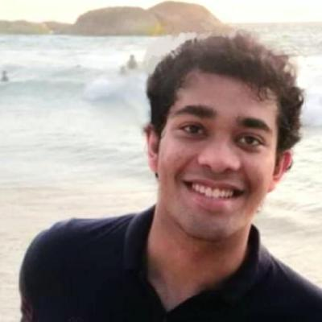

[AAAI-23 UC @ the AAAI site ](https://aaai.org/Conferences/AAAI-23/undergraduate-consortium/)  
Return to [the main AAAI Undergraduate Consortium page](https://aaai-uc.github.io/)

[AAAI 2023 main site](https://aaai.org/Conferences/AAAI-23/)  
Thirty-Seventh AAAI Conference on Artificial Intelligence  
February 7 - February 14, 2023

# AAAI-23 Undergraduate Consortium 

<!--See our AAAI-22 scholars talk about their research! The youtube playlist of AAAI-22 UC pitch videos is [available here](https://www.youtube.com/watch?v=dXsupAQAKgs&list=PLIsth1r16Z2MHJ9jItF2MLGzQgAjH8QN8), and links to individual videos accompany each scholar's profile, below. -->

# Meet our scholars!

## Kaihua (William) Hou
  
Electrical Engineering and Computer Science Departments  
Johns Hopkins University  

<!--[3-min pitch video](https://www.youtube.com/watch?v=b6_19zPghts&list=PLIsth1r16Z2MHJ9jItF2MLGzQgAjH8QN8&index=12)   -->

Kaihua (William) Hou is an undergraduate student studying Electrical Engineering and Computer Science at Johns Hopkins University. He works at the JHU Malone Center for Engineering in Healthcare under the mentorship of Dr. Mathias Unberath and Dr. Jithin Yohannan. He is also a visiting research assistant at the Massachusetts Institute of Technology, advised by Dr. John Guttag. His research interests lie at the intersection of machine learning, equitable healthcare, and clinical decision-making.

### Abstract 
Visual fields (VF) and optical coherence tomography (OCT) are two commonly used eye exams to diagnose glaucoma and track its worsening. However, two clinicians each examining a different test of the same patient may arrive at contradicting diagnoses. This is undesirable since neither test can be used as a sole objective standard for disease assessment, and the choice of test can heavily depend on non-clinical reasons (e.g. cost or availability) instead of the patient’s conditions. To help clinicians obtain the progressive trends of one eye exam given a time series of another, this project uses two gated Transformers (GTN): one Transformer learns changes in the same input feature across time, while the other one learns correlations between different input features at the same time stamp. This model significantly outperformed prior methods, and the feature importance of the GTN was investigated through Shapely analysis.

## Joseph Sankah
  
College of Engineering and Architecture   
Howard University   
<!--[https://vishakha-a.github.io/](https://vishakha-a.github.io)  
[3-min pitch video](https://www.youtube.com/watch?v=0E2jPSKyNQk&list=PLIsth1r16Z2MHJ9jItF2MLGzQgAjH8QN8&index=7)   -->

Joseph Sankah is a sophomore undergraduate student majoring in computer science at Howard University. He is a software engineer and a tech enthusiast especially in the domain of Artificial Intelligence. He currently serves as an undergraduate researcher assistant in the Affective Biometrics Lab where he surveys and analyzes some select open-source Artificial Intelligence/machine learning biometric toolkits and tools used for face detection, recognition, and verification. To this end, I seeks to develop a vulnerability-and-testing protocol in a bid to investigate the robustness of these AI biometric models under the aegis of Dr. Saurav Aryal and Dr. Gloria Washington of the Affective Biometric Lab with support and funding from the Applied Laboratory Research for Intelligence and Security(ARLIS).

### Abstract 
While the quest to evaluate the robustness of open-source Artificial Intelligence/machine learning biometric tools and toolkits seems to be fledging, the effectiveness in measuring their efficiency and robustness is almost always based on the outcome when original face images are fed into the AI biometrics models to the neglect of images with noisy features and varied brightness. Arguably, feeding our open-source AI biometrics models—in the domain of face detection, recognition, and verification—with a large pool of face datasets diversified with noisy features and varied brightness would go a long way to helping the AI biometric community to thoroughly survey and analyze these models in hopes of designing a methodology for their cyber-assessment and auditing. In that regard, the AI biometrics community would be able to test the robustness of the AI biometrics models against their vulnerabilities or weaknesses by comparing the actual outcome with their expected result.

## Aman Priyanshu
   
Department of Information and Communication Technology  
Manipal Institute of Technology   
[https://amanpriyanshu.github.io/](https://amanpriyanshu.github.io/) 
<!--[3-min pitch video](https://www.youtube.com/watch?v=2UVLACiXnM0&list=PLIsth1r16Z2MHJ9jItF2MLGzQgAjH8QN8&index=14)   -->

I am Aman Priyanshu, a senior at Manipal Institute of Technology, currently pursuing my undergrad in Information Technology. My research interests include Privacy Preserving Machine Learning, Explainable AI, Fairness, and AI for Social Good. I have recently focused on areas such as Reinforcement Learning, Causal Inference, Bias Mitigation, and Low-Resource Computations. I have had the opportunity to gain practical experience through internships, including working as a Privacy Engineer Intern at Eder Labs R&D Private Limited, a MITACS Research Intern at Concordia University, and as an Undergraduate Research Assistant at Manipal Institute of Technology. I have also had the opportunity to have several publications in the field of machine intelligence and security and have won awards for my projects. My explorations in technology are also extended to participating in hackathons, where I've applied my research to developing applications aimed at social good. I intend to pursue a doctoral after my undergrad. 

### Abstract 
Deep Learning has seen expansive growth over the last decade. Especially within fields that entail learning sensitive information, like Healthcare, Legal-Proceedings, and even Social-Analytics. A lot of these domains have seen decentralization and private learning methods such as Federated Learning being adopted. However, ensuring Fairness within FL settings is difficult due to inequitable demographic representation. This work aims at incorporating disparate retention through superimposed supermasks to understand private attribute demographic association. It leverages subnetwork identification to detect attributes associated with demographic identities for bias mitigation. By employing continual-learning paradigms, we ensure performance retention alongside Fairness in a disproportionate representation setting.

## Khushi Bhansali
  
CMNS   
University of Maryland College Park  
[https://khushi-bhansali.weebly.com](https://khushi-bhansali.weebly.com)   
<!--[3-min pitch video](https://www.youtube.com/watch?v=f-YSEJj2GpU&list=PLIsth1r16Z2MHJ9jItF2MLGzQgAjH8QN8&index=5)   -->

Khushi Bhansali is pursuing her Bachelor of Science from the University of Maryland College Park. She is majoring in Computer Science with a concentration in Machine Learning and has received dean's list honorable mention every semester of her undergraduate studies. She is currently doing research for the Maryland Center for Blended Reality and has interned at Goldman Sachs, US FDA, and Johns Hopkins Applied Physics Lab. Outside of academics, she is the VP of Finance for a charity club named One for the World, a teaching instructor for the Maryland Center for Women In Computing, and a modeling editor for Chameleon, a university-led magazine for people of color. 

### Abstract 
Under the guidance of Dr. Amitabh Varshney, I have been capturing motion sensor data from the AR/VR headset. We discovered that heart and chest vibrations induce an involuntary movement of the head which can be used to infer heart rate. Body-signal side-channel adversaries could exploit this data to intelligently learn breathing patterns to detect arrhythmia or other heart conditions without consent. Deep learning algorithms can detect these privacy threats without relying on previous or common attack patterns. They recognize the presence of bad actors while preserving the privacy of the training dataset. Thus, I aspire to develop signal scrambling algorithms using privacy-preserving deep neural networks because of their high efficiency in data anonymization and ability to protect people from the new privacy risks that AR/VR systems pose.

## Anna Prince
  
Linguistics and Government  
Georgetown University   
<!--[https://www.linkedin.com/in/hannah-claus-042382199/](https://www.linkedin.com/in/hannah-claus-042382199/)   
[3-min pitch video](https://www.youtube.com/watch?v=eyRyz5ltcco&list=PLIsth1r16Z2MHJ9jItF2MLGzQgAjH8QN8&index=4)   -->

Anna is a junior at Georgetown University pursuing dual majors in linguistics and government. Her academic interests include propaganda, influence campaigns, and the intersection of technology and democracy. She hopes to pursue an advanced degree in computational social science in order to produce research that can assist government agencies, such as law enforcement and policy-makers, to make more informed and equitable decisions in the digital sphere. In her free time, she enjoys distance running and language-learning.

### Abstract 
While the ability to detect harmful artificial online activity has improved, identifying and classifying harmful human groups remains a difficult task. This research proposal builds on Ashokkumar and Pennebaker’s (2022) use of LIWC to detect social media group membership, further arguing that n-gram analysis and sentiment classification of in-group neologisms could be a useful way of proactively identifying groups at risk of violence. If successful, this project could be a useful tool for law enforcement, as it would provide a real-time view of potential threats with fewer privacy trade-offs.

## Supriti Vijay
  
Department of Computer Science  
Manipal Academy of Higher Education  
[https://supritivijay.github.io/](https://supritivijay.github.io/)   
<!--[3-min pitch video](https://www.youtube.com/watch?v=qVO8cSIbMaY&list=PLIsth1r16Z2MHJ9jItF2MLGzQgAjH8QN8&index=9)   -->

Supriti is a senior at the Manipal Academy of Education, pursuing her bachelor's degree in Computer science and Engineering. Her research interests lie in Natural Language Processing, computational social science, Explainable AI, and Social Networks. She is passionate about working on NLP for social good, making models fairer, accountable, transparent, and ethical. She is a recipient of the Adobe India Women-In-Tech Scholarship and has also been awarded the Mitacs Globalink Research Internship. Beyond research, she is motivated to empower and mentor girls to build their careers in STEM. She also runs a non-profit, Felasa, aiming to create awareness among women about legal and safety laws around them and also helps connect lawyers to victims of gender-based crimes. She plans to pursue a graduate degree in Computer Science specializing in NLP.

### Abstract 
The presence of implicit bias in the text corpora is one of the most prominent issues while training any downstream NLP task. The exhibition of these gender biases emphasizes stereotypes prevalent in the real world onto models and causes drastic repercussions among those involved. Therefore, gender bias mitigation is an integral aspect of standard NLP tasks. Ideally, these models must be debiased before deployment. However, data augmentation is an expensive task for large corpora, while prior work on reconstructing word embeddings for debiasing may not always be conducive to performance reduction. Therefore, this work proposes training a semi-supervised regularizing loss function for debiasing large language models (LLMs). Integrating a regularizing loss function in the training phase, a method yet to be widely explored, would help us examine its effects on mitigating bias. This work also aims to create an easy-to-use library for debiasing to allow streamlined integration into most high-performance LLMs, contributing towards making models more fair and equitable.

## Pratinav Seth
  
Dept. of Data Science & Computer Applications, Manipal Institute of Technology  
Manipal Academy of Higher Education  
[https://ptnv-s.github.io/](https://ptnv-s.github.io/)   
<!--[3-min pitch video](https://www.youtube.com/watch?v=XkU9ZXvMJtU&list=PLIsth1r16Z2MHJ9jItF2MLGzQgAjH8QN8&index=10)   -->

Pratinav Seth is a junior at Manipal Institute of Technology pursuing a Bachelor's in Technology with a major in Data Science. His research interests include Uncertainity Quantification, Medical Imagery, Trustworthy AI, and AI for Social Good. He is an Intern at KLIV Lab, IIT-Kharagpur working on Trustworthy Deep Learning based applications for Radiology based disease diagnostics. He is the Executive Head of the Research Society Manipal, an initiative to promote and facilitate the development of a research community among undergraduates. After obtaining his undergraduate degree, he intends to get a doctoral degree aimed at Model agnostic solutions for Quantifying Trustworthiness. 

### Abstract 
With the advent of technology and increased availability of resources, many applications have deployed AI-based models in some form or shape. However, ensuring that these systems behave responsibly and are trustworthy is critical. The uncertainty estimation is essential to trust confident model predictions for screening automation and referring uncertain cases for manual intervention of a domain expert. Previous works involve building a completely different architecture which is typically costly when deployed. Here we aim to develop a model-agnostic solution to monitor the trustworthiness and confidence of the model predictions, which can be incorporated with currently deployed models and signal a failure in case of low confidence. The impact of this work will be immense and will change the outlook and increase the confidence of everyone towards AI. It can be impactful in areas such as  healthcare, where it would significantly aid in risk appraisal, lowering the possibility of potential misdiagnosis.

## Nora Lewis
  
School of Public Affairs and Department of Computer Science    
American University    
[https://www.linkedin.com/in/willa-potosnak-4679b119a/](https://www.linkedin.com/in/willa-potosnak-4679b119a/)   
<!--[3-min pitch video](https://www.youtube.com/watch?v=drKqN1h3VVE&list=PLIsth1r16Z2MHJ9jItF2MLGzQgAjH8QN8&index=13)   -->

Nora Lewis is a junior at American University studying Data Science in Justice, Law, and Criminology and Computer Science. She is also in the combined BS/MS program for Data Science with a concentration in CS. At American, she works as a teaching assistant in the Computer Science department and as a research assistant at the Polarization and Extremism Research and Innovation Lab (PERIL). In her free time, she likes to read, listen to music (specifically Taylor Swift), and exploring DC! 

### Abstract 
Dogwhistle is a type of coded language that primes an in-group to respond in a certain way, while the general population ignores it. These coded words fly under the radar of most social media terms of services, even though many extremist groups use these as a call to arms, because the words themselves are not seen as harmful. Being able to recognize the use of dogwhistles in social media posts would help to limit the outreach of extremist groups and harmful rhetoric and help prevent possible indoctrination. Using NLP and the Anti-Defamation League’s Hate on Display database, we trained a ML model to pick up on these dogwhistles in social media posts. Dogwhistles work best when the general public doesn’t understand them- so bringing them into the spotlight could render them useless.

## Teanna Barrett
  
Department of Electrical Engineering and Computer Science   
Howard University   
<!--[http://wes-robbins.xyz](http://wes-robbins.xyz/)   
[3-min pitch video](https://www.youtube.com/watch?v=dXsupAQAKgs&list=PLIsth1r16Z2MHJ9jItF2MLGzQgAjH8QN8&index=1)   -->

Teanna Barrett (she/her) is a senior Computer Science major and Philosophy minor from Howard University. Her research aims to interrogate the design, deployment, and evaluation of Machine Learning systems to understand contemporary anti-blackness and inform liberatory technology. She currently works with the Affective Biometrics Lab under the direction of Dr. Gloria Washington at Howard University and the Social Futures Lab under the direction of Dr. Amy Zhang at the University of Washington. 

### Abstract 
Proprietary Machine Learning (ML) technology embedded in products such as PredPol and COMPAS has been found to target Black and Brown people more than White people. Thus, the material inequities within the United States policing system are replicated in ML models. However, there is another systemic disparity that is not well-researched in the ML community, skin tone stratification. This research study aims to investigate skin tone bias in criminal justice ML models and particular recidivism models. With manual skin tone annotations, recidivism scores disaggregated by skin tone categories can be analyzed for disparities. In addition, this project aims to further interrogate the relationship between ML and the prison industrial complex. 

## Collin Coil
  
Department of Mathematics and Statistics   
American University   
<!--[3-min pitch video](https://www.youtube.com/watch?v=aSiSyynzXeE&list=PLIsth1r16Z2MHJ9jItF2MLGzQgAjH8QN8&index=6)   -->

Collin Coil is a junior studying pure mathematics and data science. He is engaged in applied statistics and data science research through the AU Center for Data Science, and he is interesting in pursuing a graduate program to focus on machine learning once he finishes his undergraduate degree. Outside of academics, Collin is a member of the American University Rowing Club and enjoys baking.

### Abstract 
The need for high-quality training data currently serves as a bottleneck for the development and deployment of machine learning models. Currently, manually generated data is often too expensive, and machine labeled data suffers from bias. One potential technique to satiate the growing data requirements by using artificial intelligence to generate synthetic data. One promising generative technique is known as Implicit Maximum Likelihood Estimation. This approach has yet to be applied to large-scale synthetic data generation, but it has advantages over other models. These include no mode collapse, vanishing gradients, or training instability. 

## Chi Phuong Huynh
  
Computer Science   
Franklin and Marshall College   
<!--[3-min pitch video](https://www.youtube.com/watch?v=aSiSyynzXeE&list=PLIsth1r16Z2MHJ9jItF2MLGzQgAjH8QN8&index=6)   -->

Chi is an undergraduate student at Franklin & Marshall College, studying Computer Science and Applied Mathematics. Her research focuses on improving multi-modal machine learning algorithms and applying them to higher idea abstraction levels and data processing problems. She plans to continue work as a Ph.D. student, working on highly applicable AI and machine learning models. She is currently working with professor Brad McDanel (Franklin and Marshall College) on improving text-to-image transformers and professor Chen Sun (Brown University) on AI for computational creativity. 

### Abstract 
Transformers have become popular in the computer vision field due to their superior performance compared to CNNs, however, they are hindered by extensive training time. My project focuses on using input modifications method to improve performance of vision and multi-modal transformers and diffusers model. By patch removal or concatenating patches, we can improve the computational complexity of these machine learning models and help them be more robust at inference time. I investigated data sparsification and scheduling with vision transformers. As input images for transformers are split into patches, by cyclically scheduling the removal of the less important patches, we can reduce training time by 31% with minimal loss to accuracy. Recent papers have also showed that by stacking or masking patches, we can also reduce training time while not risking information loss. Applying similar ideas to text-to-image transformers and diffusion models can yield improved computational complexity and performance. 
